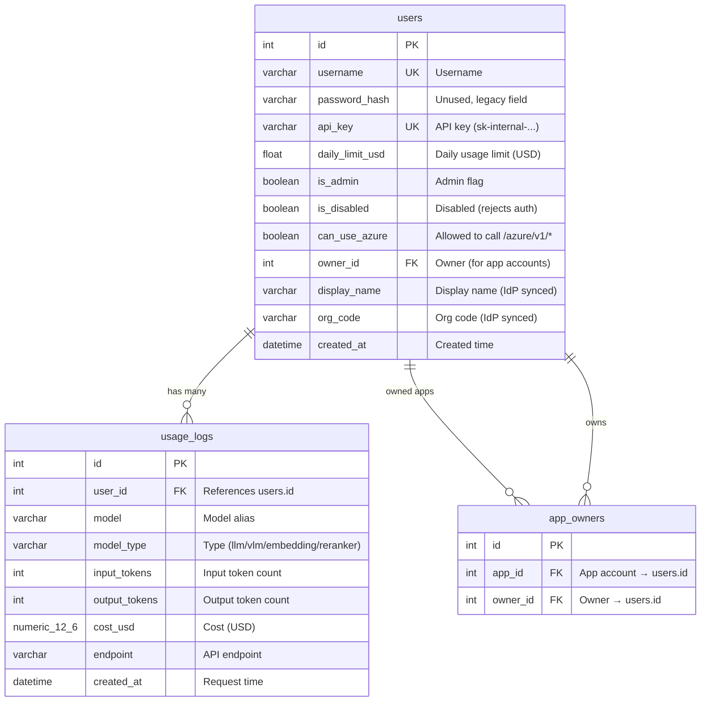

# Alembic — Database Migration Management

[中文版](README.zh-TW.md)

[Alembic](https://alembic.sqlalchemy.org/) is SQLAlchemy's database migration tool, managing PostgreSQL schema version control. When model definitions in `app/models/schema.py` change, Alembic generates corresponding migration scripts to safely upgrade or downgrade the database schema.

## How It Works

```
schema.py (Python Model) ──autogenerate──▶ versions/*.py (migration scripts)
                                                  │
                                            alembic upgrade head
                                                  │
                                                  ▼
                                          PostgreSQL schema
```

1. **Model definitions** — `app/models/schema.py` defines `User`, `AppOwner`, and `UsageLog` tables using SQLModel
2. **Autogenerate** — Alembic compares models against current database, auto-generates migration scripts
3. **Migration scripts** — Stored in `versions/` directory, each file contains `upgrade()` and `downgrade()` functions
4. **Version chain** — Each migration records the previous revision ID, forming an ordered chain
5. **alembic_version table** — PostgreSQL maintains an `alembic_version` table tracking the current revision

## Common Commands

```bash
# Apply all pending migrations (required on deploy)
uv run alembic upgrade head

# View current database version
uv run alembic current

# View unapplied migrations
uv run alembic history --indicate-current

# After modifying schema.py, auto-generate a new migration
uv run alembic revision --autogenerate -m "describe your change"

# Downgrade one version (use with caution)
uv run alembic downgrade -1

# First-time Alembic adoption on existing database (mark as current, skip migrations)
uv run alembic stamp head
```

## Directory Structure

```
alembic/
├── README.md          # This file
├── README.zh-TW.md    # Chinese version
├── env.py             # Reads DATABASE_URL, configures migration environment
├── script.py.mako     # Migration file template
└── versions/          # Migration scripts (chronological order)
    ├── ae7ecabcf79d_initial_schema_users_and_usage_logs.py
    ├── a3c2d266f101_change_cost_usd_from_float_to_numeric_.py
    ├── b4e1f8a23d01_add_display_name_and_org_code_to_users.py
    ├── c7f3e9b45a02_add_created_at_index_on_usage_logs.py
    ├── d5a2c3e67f04_add_app_owners_table.py
    ├── e8b4f1a23c05_replace_user_created_index_with_covering.py
    ├── 5d538cdf0e8b_merge_app_owners_and_covering_index_.py
    └── f3a91c5b8d27_add_is_disabled_and_can_use_azure_to_users.py
```

## Migration History

| Revision | Description | Date |
|---|---|---|
| `ae7ecabcf79d` | Initial schema: create `users` and `usage_logs` tables | 2026-03-11 |
| `a3c2d266f101` | Change `cost_usd` from `FLOAT` to `NUMERIC(12,6)` for better precision | 2026-03-11 |
| `b4e1f8a23d01` | Add `display_name` and `org_code` columns to `users` table | 2026-03-13 |
| `c7f3e9b45a02` | Add `ix_usage_created_at` index (for DAU queries) | 2026-03-13 |
| `d5a2c3e67f04` | Add `app_owners` many-to-many table (app account ownership) | 2026-03-14 |
| `e8b4f1a23c05` | Replace `ix_usage_user_created` with covering index `ix_usage_user_date_cost` (CONCURRENTLY) | 2026-03-15 |
| `5d538cdf0e8b` | Merge `app_owners` and covering index branches | 2026-03-15 |
| `f3a91c5b8d27` | Add `is_disabled` and `can_use_azure` boolean columns to `users` (`server_default=false`; PG 11+ adds these as a metadata-only operation, no table rewrite) | 2026-05-05 |

## Database Schema



### Table Details

**users** — Users and App Accounts

| Column | Type | Description |
|---|---|---|
| `id` | `INTEGER` PK | Auto-increment primary key |
| `username` | `VARCHAR` UNIQUE | Username (OAuth2 SSO `sub` claim) |
| `password_hash` | `VARCHAR` | Unused, defaults to empty string (legacy field) |
| `api_key` | `VARCHAR` UNIQUE | Auto-generated, format `sk-internal-{timestamp}-{hex8}` |
| `daily_limit_usd` | `FLOAT` | Daily usage limit, default 10.0 USD |
| `is_admin` | `BOOLEAN` | Admin flag in DB (Web UI admin determined by JWT scope) |
| `is_disabled` | `BOOLEAN` | Default `false`. When `true`, both API key and JWT auth reject the user with 403 (admins bypass) |
| `can_use_azure` | `BOOLEAN` | Default `false`. Gates `/azure/v1/*` endpoints (admins bypass) |
| `owner_id` | `INTEGER` FK → `users.id` | App account owner, NULL for regular user accounts |
| `display_name` | `VARCHAR` | Display name from IdP JWT, auto-synced on each login |
| `org_code` | `VARCHAR` | Org code from IdP JWT, auto-synced on each login |
| `created_at` | `DATETIME` | Creation time (UTC) |

**usage_logs** — API Usage Records

| Column | Type | Description |
|---|---|---|
| `id` | `INTEGER` PK | Auto-increment primary key |
| `user_id` | `INTEGER` FK → `users.id` | Requesting user |
| `model` | `VARCHAR` | Model alias used |
| `model_type` | `VARCHAR` | Model type: `llm`, `vlm`, `embedding`, `reranker`, etc. |
| `input_tokens` | `INTEGER` | Input token count |
| `output_tokens` | `INTEGER` | Output token count |
| `cost_usd` | `NUMERIC(12,6)` | Calculated cost (USD), 6 decimal places |
| `endpoint` | `VARCHAR` | API endpoint path (e.g. `/v1/chat/completions`) |
| `created_at` | `DATETIME` | Request time (UTC) |

### Indexes

| Index Name | Table | Columns | Description |
|---|---|---|---|
| `ix_users_username` | `users` | `username` | UNIQUE — fast user lookup |
| `ix_users_api_key` | `users` | `api_key` | UNIQUE — API key auth lookup |
| `ix_users_owner_id` | `users` | `owner_id` | App account owner lookup |
| `ix_usage_user_date_cost` | `usage_logs` | `user_id`, `created_at`, `cost_usd` | Covering index — daily limit index-only scan |
| `ix_usage_created_at` | `usage_logs` | `created_at` | DAU stats, time-range queries |
| `ix_app_owners_app_id` | `app_owners` | `app_id` | App account owner lookup |
| `ix_app_owners_owner_id` | `app_owners` | `owner_id` | User's owned apps lookup |

## Notes

- `env.py` reads `DATABASE_URL` from `app.core.config` — ensure `.env` is properly configured
- Auto-generated migrations should be manually reviewed, especially those involving data transformations
- Always back up the database before downgrading in production
- For SQLite to PostgreSQL migration, use `scripts/migrate_sqlite_to_pg.py`, not Alembic
