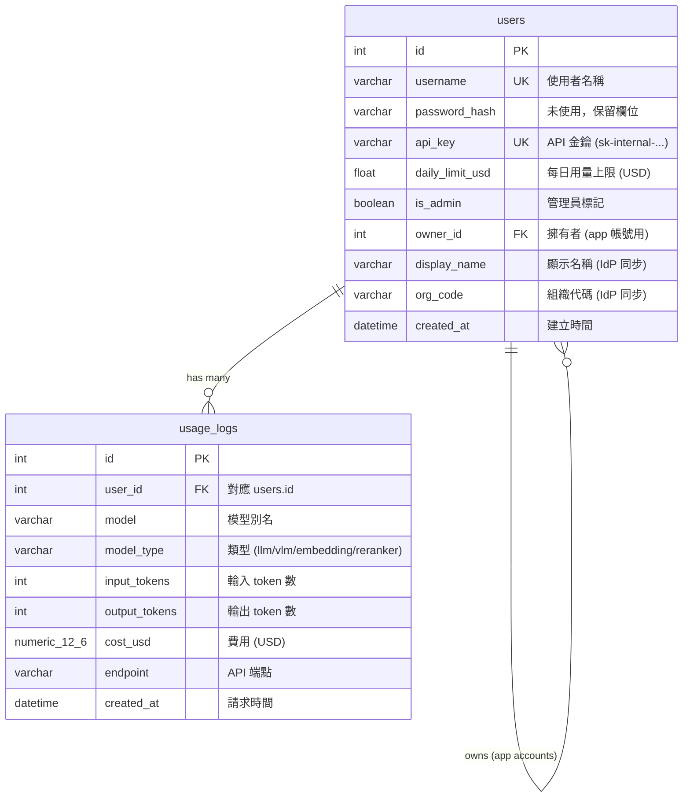

# Alembic — 資料庫遷移管理

[Alembic](https://alembic.sqlalchemy.org/) 是 SQLAlchemy 的資料庫遷移工具，負責管理 PostgreSQL schema 的版本控制。當 `app/models/schema.py` 中的 Model 定義變更時，Alembic 會產生對應的 migration script，讓資料庫結構安全地升級或降級。

## 運作原理

```
schema.py (Python Model) ──autogenerate──▶ versions/*.py (migration scripts)
                                                  │
                                            alembic upgrade head
                                                  │
                                                  ▼
                                          PostgreSQL schema
```

1. **Model 定義** — `app/models/schema.py` 用 SQLModel 定義 `User` 和 `UsageLog` 兩張表
2. **Autogenerate** — Alembic 比較 Model 與目前資料庫的差異，自動產生 migration script
3. **Migration script** — 記錄在 `versions/` 目錄，每個檔案包含 `upgrade()` 和 `downgrade()` 函式
4. **Version chain** — 每個 migration 記錄前一版的 revision ID，形成有序鏈
5. **alembic_version 表** — PostgreSQL 中會有一張 `alembic_version` 表，記錄目前套用到哪個 revision

## 常用指令

```bash
# 套用所有 pending migrations（部署時必做）
uv run alembic upgrade head

# 查看目前資料庫版本
uv run alembic current

# 查看尚未套用的 migrations
uv run alembic history --indicate-current

# 修改 schema.py 後，自動產生新的 migration
uv run alembic revision --autogenerate -m "describe your change"

# 降級一個版本（小心使用）
uv run alembic downgrade -1

# 已有資料庫首次納入 Alembic 管理（標記為最新，不執行 migration）
uv run alembic stamp head
```

## 目錄結構

```
alembic/
├── README.md          # 本文件
├── env.py             # 讀取 DATABASE_URL，設定 migration 環境
├── script.py.mako     # migration 檔案模板
└── versions/          # migration scripts（按時間順序）
    ├── ae7ecabcf79d_initial_schema_users_and_usage_logs.py
    ├── a3c2d266f101_change_cost_usd_from_float_to_numeric_.py
    └── b4e1f8a23d01_add_display_name_and_org_code_to_users.py
```

## Migration 歷史

| Revision | 說明 | 日期 |
|---|---|---|
| `ae7ecabcf79d` | 初始 schema：建立 `users` 和 `usage_logs` 表 | 2026-03-11 |
| `a3c2d266f101` | `cost_usd` 從 `FLOAT` 改為 `NUMERIC(12,6)` 提升精度 | 2026-03-11 |
| `b4e1f8a23d01` | 新增 `display_name` 和 `org_code` 欄位至 `users` 表 | 2026-03-13 |

## 資料庫 Schema



### 表說明

**users** — 使用者與 App 帳號

| 欄位 | 類型 | 說明 |
|---|---|---|
| `id` | `INTEGER` PK | 自動遞增主鍵 |
| `username` | `VARCHAR` UNIQUE | 使用者名稱（OAuth2 SSO 的 `sub` claim） |
| `password_hash` | `VARCHAR` | 未使用，預設空字串（歷史欄位） |
| `api_key` | `VARCHAR` UNIQUE | 自動產生，格式 `sk-internal-{timestamp}-{hex8}` |
| `daily_limit_usd` | `FLOAT` | 每日用量上限，預設 10.0 USD |
| `is_admin` | `BOOLEAN` | 資料庫中的管理員標記（Web UI admin 由 JWT scope 決定） |
| `owner_id` | `INTEGER` FK → `users.id` | App 帳號的擁有者，NULL 表示一般使用者帳號 |
| `display_name` | `VARCHAR` | 顯示名稱，來自 IdP JWT，每次登入自動同步 |
| `org_code` | `VARCHAR` | 組織代碼，來自 IdP JWT，每次登入自動同步 |
| `created_at` | `DATETIME` | 建立時間 (UTC) |

**usage_logs** — API 使用記錄

| 欄位 | 類型 | 說明 |
|---|---|---|
| `id` | `INTEGER` PK | 自動遞增主鍵 |
| `user_id` | `INTEGER` FK → `users.id` | 請求的使用者 |
| `model` | `VARCHAR` | 使用的模型別名 |
| `model_type` | `VARCHAR` | 模型類型：`llm`, `vlm`, `embedding`, `reranker` 等 |
| `input_tokens` | `INTEGER` | 輸入 token 數量 |
| `output_tokens` | `INTEGER` | 輸出 token 數量 |
| `cost_usd` | `NUMERIC(12,6)` | 計算的費用（USD），精度到小數點後 6 位 |
| `endpoint` | `VARCHAR` | API 端點路徑（如 `/v1/chat/completions`） |
| `created_at` | `DATETIME` | 請求時間 (UTC) |

### 索引

| 索引名稱 | 表 | 欄位 | 說明 |
|---|---|---|---|
| `ix_users_username` | `users` | `username` | UNIQUE — 快速查詢使用者 |
| `ix_users_api_key` | `users` | `api_key` | UNIQUE — API key 認證查詢 |
| `ix_users_owner_id` | `users` | `owner_id` | App 帳號擁有者查詢 |
| `ix_usage_user_created` | `usage_logs` | `user_id`, `created_at` | 複合索引 — 用量統計與每日限額查詢 |

## 注意事項

- `env.py` 會從 `app.core.config` 讀取 `DATABASE_URL`，確保 `.env` 已正確設定
- 自動產生的 migration 需要人工檢查，特別是涉及資料轉換時
- 正式環境降級前務必備份資料庫
- 從 SQLite 遷移到 PostgreSQL 請使用 `scripts/migrate_sqlite_to_pg.py`，不是 Alembic
