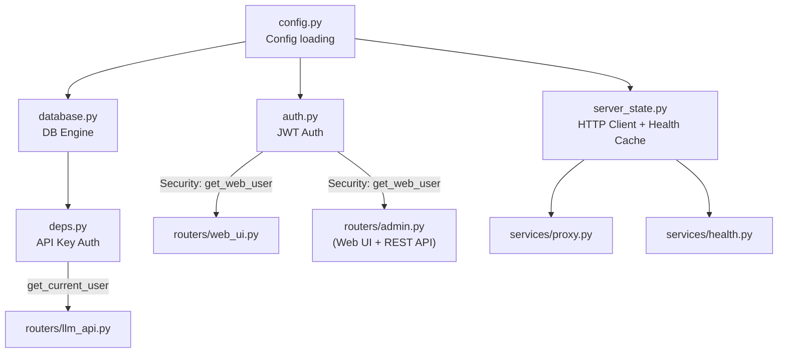

# Core — Foundation Modules

[中文版](README.zh-TW.md)

Provides authentication, configuration, database connections, and HTTP client management — shared infrastructure used by routers and services.

## Module Overview



---

## Module Details

### `config.py` — Configuration Parser

Parses `config.toml` and `.env`, producing global configuration objects.

| Export | Type | Source | Description |
|---|---|---|---|
| `APP_TITLE` | `str` | `.env` | Service name shown in UI title and navbar |
| `DATABASE_URL` | `str` | `.env` | PostgreSQL connection string |
| `AUTH_CENTER_APP_ID` | `str` | `.env` | JWT audience validation value |
| `AUTH_CENTER_PUBLIC_KEY_PATH` | `str` | `.env` | RS256 public key path |
| `AUTH_BASE_URL` | `str` | `.env` | JWT issuer validation value (default `auth-center`) |
| `MODEL_ROUTING` | `dict[str, dict]` | `config.toml` | Model routing table: alias → `{base_url, real_model, api_key, type}` |
| `PRICING_MAP` | `dict[str, dict]` | `config.toml` | Pricing table: type → `{input_price_per_1m, output_price_per_1m}` |
| `FALLBACK_MAP` | `dict[str, str]` | `config.toml` | Fallback table: type → preferred fallback model alias |

**Key functions:**

| Function | Description |
|---|---|
| `reload_config()` | Re-reads `config.toml`, updates global dicts in-place (thread-safe) |
| `save_config(models, pricing, fallback)` | Writes back to `config.toml` (atomic write) and auto-reloads |
| `get_config_data()` | Returns JSON-serializable config snapshot (for Admin UI) |

---

### `auth.py` — JWT Authentication (Web UI)

Handles JWT authentication for the Web UI. After nginx obtains the access token from oauth2-proxy, it injects `Authorization: Bearer <JWT>` into the request header.

```
Browser → nginx → oauth2-proxy (validates session cookie)
                        ↓ pass
               nginx injects Authorization header
                        ↓
               FastAPI → auth.py → get_web_user()
```

| Function | Returns | Description |
|---|---|---|
| `get_web_user(security_scopes, request, session, credentials)` | `User` | FastAPI `Security` dependency: decodes JWT, checks scopes, auto-creates new users |
| `_decode_jwt(token)` | `dict \| None` | RS256 decode + audience/issuer validation |
| `_sync_user(session, username, display_name, org_code)` | `User` | Find or create user, sync IdP fields |

**Usage:**
```python
# Declare required scope at route level
user: User = Security(get_web_user, scopes=["read"])   # read or admin
user: User = Security(get_web_user, scopes=["admin"])   # admin only

# Set at router level (applies to all routes)
router = APIRouter(dependencies=[Security(get_web_user, scopes=["admin"])])
```

**Key behaviors:**
- First-time login users are auto-provisioned, with `display_name` and `org_code` saved from JWT
- On subsequent logins, `display_name` and `org_code` are auto-synced if changed in IdP
- Returned `User` is **expunged** from session; `is_admin` is set dynamically from JWT scope, not written to DB
- `"admin"` scope automatically satisfies any scope requirement (admin can access read pages)
- In tests, `_decode_jwt` is patched to use HS256 validation

---

### `deps.py` — API Key Authentication (/v1/* API)

FastAPI dependency that extracts the API key from `Authorization: Bearer <api_key>` header and validates against DB.

| Function | Returns | Description |
|---|---|---|
| `get_current_user(credentials, session)` | `User` | Validates API key + checks daily limit |
| `_check_daily_limit(session, user)` | — | Queries today's cumulative spend; returns 429 if `daily_limit_usd` exceeded |

**Auth flow:**

```
Request header: Authorization: Bearer sk-internal-...
       ↓
HTTPBearer extracts token
       ↓
DB query: SELECT * FROM users WHERE api_key = ?
       ↓
Check daily_limit_usd vs today's cumulative cost_usd
       ↓
Return User object (or 401 / 429)
```

---

### `database.py` — Database Engine

Creates SQLAlchemy engine and provides session factory.

| Export | Description |
|---|---|
| `engine` | SQLAlchemy engine. PostgreSQL enables connection pooling (pool_size=20, max_overflow=30) |
| `init_db()` | Creates all tables (dev only; production uses Alembic) |
| `get_session()` | FastAPI dependency, yields a Session |

**Connection pool parameters** (PostgreSQL only):

| Parameter | Value | Description |
|---|---|---|
| `pool_pre_ping` | `True` | Pings before checkout to avoid stale connections |
| `pool_size` | `20` | Resident connection count |
| `max_overflow` | `30` | Extra connections during peak (up to 50 total) |
| `pool_timeout` | `30` | Timeout in seconds waiting for available connection |

---

### `server_state.py` — HTTP Client + Health Cache

Manages global `httpx.AsyncClient` and downstream server health cache.

| Function | Description |
|---|---|
| `init_client()` | Creates AsyncClient (timeout 30s, max_connections 200) |
| `close_client()` | Closes AsyncClient (called on app shutdown) |
| `get_client()` | Gets AsyncClient instance |
| `set_alive(base_url, alive)` | Updates health cache (called by health check loop) |
| `is_alive(base_url)` | Queries whether a server is alive |
| `prune_cache(active_urls)` | Removes cache entries no longer in MODEL_ROUTING |
| `all_health()` | Returns health status dict for all servers |

**Client parameters:**

| Parameter | Value |
|---|---|
| Timeout | 30s (connect 10s) |
| Max connections | 200 |
| Max keepalive | 40 |
| Follow redirects | `True` |

---

### `logger.py` — Logging

Uses [Loguru](https://github.com/Delgan/loguru) for formatted output.

```
2026-03-12 14:30:00 | INFO     | llm_gateway | Usage | user=alice model=radllm in=150 out=200 cost=$0.000525
```

---

## Dual Auth System

This project has two independent authentication mechanisms for different use cases:

| | API Auth (`deps.py`) | Web/Admin Auth (`auth.py`) |
|---|---|---|
| **Purpose** | `/v1/*` API endpoints | Web UI + Admin (incl. REST API) |
| **Method** | API key (Bearer token) | JWT (injected by oauth2-proxy) |
| **Lookup** | DB `users.api_key` field | JWT `sub` claim → DB `users.username` |
| **Limit check** | Checks `daily_limit_usd` per request | None (Web UI is read-only) |
| **Admin check** | N/A | `"admin" in scopes` (JWT scope) |
| **Auto-provision** | No (unknown key → 401) | Yes (first login auto-creates user) |
