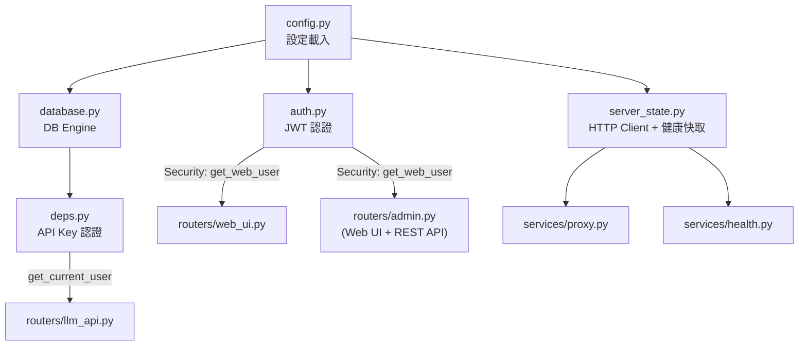

# Core — 核心基礎模組

[English](README.md)

提供認證、設定、資料庫連線、HTTP client 管理等基礎設施，被 routers 和 services 共同依賴。

## 模組總覽



---

## 各模組說明

### `config.py` — 設定解析

解析 `config.toml` 和 `.env`，產生全域設定物件。

| 匯出 | 型別 | 來源 | 說明 |
|---|---|---|---|
| `APP_TITLE` | `str` | `.env` | 服務名稱，顯示於 UI 標題和 navbar |
| `DATABASE_URL` | `str` | `.env` | PostgreSQL 連線字串 |
| `AUTH_CENTER_APP_ID` | `str` | `.env` | JWT audience 驗證值 |
| `AUTH_CENTER_PUBLIC_KEY_PATH` | `str` | `.env` | RS256 公鑰路徑 |
| `AUTH_BASE_URL` | `str` | `.env` | JWT issuer 驗證值（預設 `auth-center`） |
| `MODEL_ROUTING` | `dict[str, dict]` | `config.toml` | 模型路由表：alias → `{base_url, real_model, api_key, type}` |
| `PRICING_MAP` | `dict[str, dict]` | `config.toml` | 定價表：type → `{input_price_per_1m, output_price_per_1m}` |
| `FALLBACK_MAP` | `dict[str, str]` | `config.toml` | Fallback 表：type → 偏好的 fallback model alias |

**關鍵函式：**

| 函式 | 說明 |
|---|---|
| `reload_config()` | 重新讀取 `config.toml`，原地更新全域 dict（thread-safe） |
| `save_config(models, pricing, fallback)` | 寫回 `config.toml`（atomic write）並自動 reload |
| `get_config_data()` | 回傳 JSON-serializable 的設定快照（Admin UI 用） |

---

### `auth.py` — JWT 認證（Web UI）

處理 Web UI 的 JWT 認證。nginx 從 oauth2-proxy 取得 access token 後，以 `Authorization: Bearer <JWT>` 注入到 request header。

```
Browser → nginx → oauth2-proxy (驗證 session cookie)
                        ↓ 通過
               nginx 注入 Authorization header
                        ↓
               FastAPI → auth.py → get_web_user()
```

| 函式 | 回傳 | 說明 |
|---|---|---|
| `get_web_user(security_scopes, request, session, credentials)` | `User` | FastAPI `Security` dependency：解析 JWT，檢查 scope，自動建立新使用者 |
| `_decode_jwt(token)` | `dict \| None` | RS256 解碼 + audience/issuer 驗證 |
| `_sync_user(session, username, display_name, org_code)` | `User` | 查找或建立使用者，同步 IdP 欄位 |

**用法：**
```python
# Route 層宣告需要的 scope
user: User = Security(get_web_user, scopes=["read"])   # read 或 admin 皆可
user: User = Security(get_web_user, scopes=["admin"])   # 僅 admin

# Router 層統一設定（所有 route 自動套用）
router = APIRouter(dependencies=[Security(get_web_user, scopes=["admin"])])
```

**重要行為：**
- 第一次登入的使用者會自動建立（auto-provision），同時從 JWT 存入 `display_name` 和 `org_code`
- 後續登入時若 IdP 的 `display_name` 或 `org_code` 有變更，會自動同步更新到 DB
- 回傳的 `User` 已從 session 中 **expunge**，`is_admin` 是根據 JWT scope 動態設定，不會寫回 DB
- `"admin"` scope 自動滿足任何 scope 需求（admin 可以存取 read 頁面）
- 測試時 `_decode_jwt` 會被 patch 為 HS256 驗證

---

### `deps.py` — API Key 認證（/v1/* API）

FastAPI dependency，從 `Authorization: Bearer <api_key>` header 取出 API key，查詢 DB 驗證。

| 函式 | 回傳 | 說明 |
|---|---|---|
| `get_current_user(credentials, session)` | `User` | 驗證 API key + 檢查每日限額 |
| `_check_daily_limit(session, user)` | — | 查詢當日累計花費，超過 `daily_limit_usd` 時回傳 429 |

**認證流程：**

```
Request header: Authorization: Bearer sk-internal-...
       ↓
HTTPBearer 提取 token
       ↓
DB 查詢: SELECT * FROM users WHERE api_key = ?
       ↓
檢查 daily_limit_usd vs 今日累計 cost_usd
       ↓
回傳 User 物件（或 401 / 429）
```

---

### `database.py` — 資料庫引擎

建立 SQLAlchemy engine，提供 session factory。

| 匯出 | 說明 |
|---|---|
| `engine` | SQLAlchemy engine。PostgreSQL 時啟用連線池（pool_size=20, max_overflow=30） |
| `init_db()` | 建立所有表（僅開發用，正式環境使用 Alembic） |
| `get_session()` | FastAPI dependency，yield 一個 Session |

**連線池參數**（僅 PostgreSQL）：

| 參數 | 值 | 說明 |
|---|---|---|
| `pool_pre_ping` | `True` | 每次取出連線前先 ping，避免使用已斷開的連線 |
| `pool_size` | `20` | 常駐連線數 |
| `max_overflow` | `30` | 尖峰時可額外建立的連線數（最多 50 條） |
| `pool_timeout` | `30` | 等待可用連線的逾時秒數 |

---

### `server_state.py` — HTTP Client + 健康快取

管理全域 `httpx.AsyncClient` 和下游伺服器健康狀態快取。

| 函式 | 說明 |
|---|---|
| `init_client()` | 建立 AsyncClient（timeout 30s, max_connections 200） |
| `close_client()` | 關閉 AsyncClient（app shutdown 時呼叫） |
| `get_client()` | 取得 AsyncClient 實例 |
| `set_alive(base_url, alive)` | 更新健康快取（由 health check loop 呼叫） |
| `is_alive(base_url)` | 查詢伺服器是否存活 |
| `prune_cache(active_urls)` | 移除不再存在於 MODEL_ROUTING 的 cache entry |
| `all_health()` | 回傳所有伺服器的健康狀態 dict |

**Client 參數：**

| 參數 | 值 |
|---|---|
| Timeout | 30s（connect 10s） |
| Max connections | 200 |
| Max keepalive | 40 |
| Follow redirects | `True` |

---

### `logger.py` — 日誌設定

使用 [Loguru](https://github.com/Delgan/loguru) 格式化輸出。

```
2026-03-12 14:30:00 | INFO     | llm_gateway | Usage | user=alice model=radllm in=150 out=200 cost=$0.000525
```

---

## 雙重認證系統

本專案有兩套獨立的認證機制，分別處理不同的使用場景：

| | API 認證 (`deps.py`) | Web/Admin 認證 (`auth.py`) |
|---|---|---|
| **用途** | `/v1/*` API 端點 | Web UI + Admin（含 REST API） |
| **認證方式** | API key（Bearer token） | JWT（oauth2-proxy 注入） |
| **查詢對象** | DB `users.api_key` 欄位 | JWT `sub` claim → DB `users.username` |
| **額度檢查** | 每次請求前檢查 `daily_limit_usd` | 不檢查（Web UI 僅查看） |
| **Admin 判斷** | 不適用 | `"admin" in scopes`（JWT scope） |
| **自動建立帳號** | 否（key 不存在回 401） | 是（首次登入自動 provision） |
