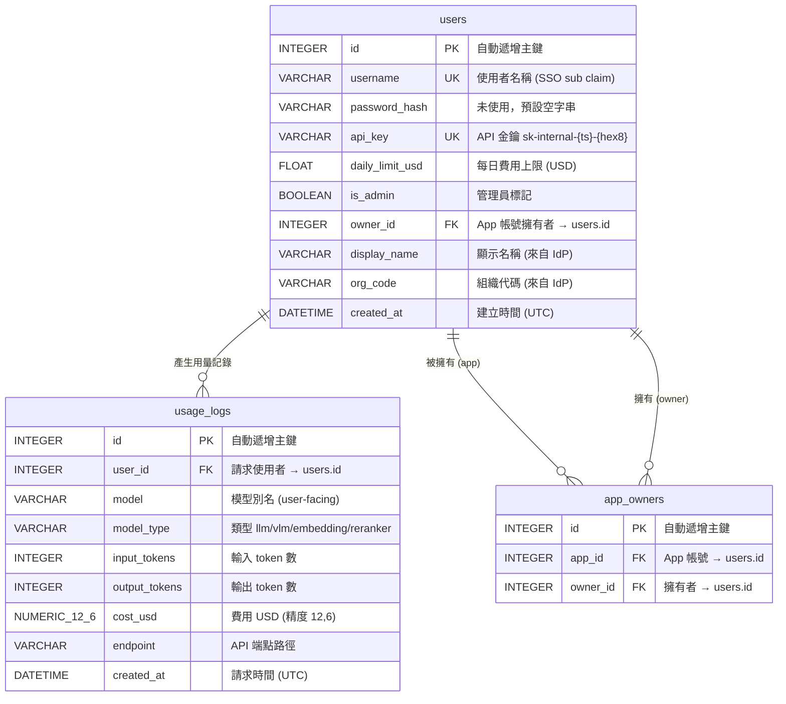
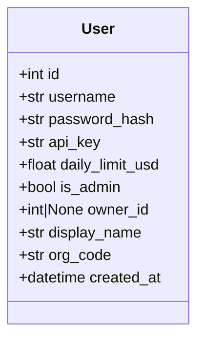
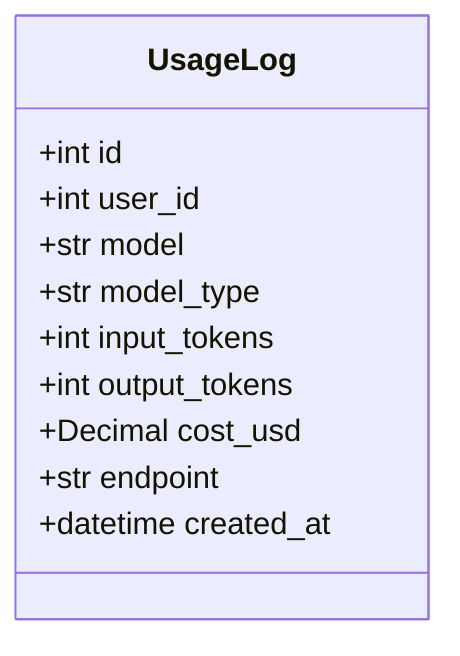

# Models — 資料庫模型定義

定義 PostgreSQL 資料表結構，使用 [SQLModel](https://sqlmodel.tiangolo.com/)（SQLAlchemy + Pydantic 整合）。

## 檔案

| 檔案 | 說明 |
|---|---|
| `schema.py` | `User`、`AppOwner`、`UsageLog` 三個 ORM Model |

## ER Diagram



## User 模型

對應資料表 `users`。代表人類使用者或程式化 App 帳號。



### 欄位詳細說明

| 欄位 | 型別 | 約束 | 預設值 | 說明 |
|---|---|---|---|---|
| `id` | `INTEGER` | PK, auto-increment | — | 主鍵，資料庫自動產生 |
| `username` | `VARCHAR` | UNIQUE, INDEX | — | SSO 登入時的 `sub` claim。App 帳號慣例以 `app_` 開頭 |
| `password_hash` | `VARCHAR` | — | `""` | **未使用**。歷史欄位，保留以維持向後相容 |
| `api_key` | `VARCHAR` | UNIQUE, INDEX | `_generate_api_key()` | 自動產生，格式 `sk-internal-{unix_timestamp}-{8位hex}`。用於 `/v1/*` API 認證 |
| `daily_limit_usd` | `FLOAT` | — | `10.0` | 每日花費上限（USD）。超過時 API 回傳 429 Too Many Requests |
| `is_admin` | `BOOLEAN` | — | `False` | 資料庫中的管理員標記。**注意：Web UI 的 admin 權限由 JWT scope 決定，不看此欄位** |
| `owner_id` | `INTEGER` | FK → `users.id`, INDEX, NULLABLE | `None` | App 帳號的擁有者。`None` 表示一般使用者帳號。Owner 可在 Dashboard 查看並管理所屬 App |
| `display_name` | `VARCHAR` | — | `""` | 使用者顯示名稱，來自 IdP JWT 的 `display_name` 欄位。每次 Web 登入時自動同步更新 |
| `org_code` | `VARCHAR` | — | `""` | 組織代碼，來自 IdP JWT 的 `org_code` 欄位。每次 Web 登入時自動同步更新。顯示於 Admin 使用者表格 |
| `created_at` | `DATETIME` | — | `datetime.now(UTC)` | 帳號建立時間 |

### API Key 產生邏輯

```python
def _generate_api_key() -> str:
    ts = int(datetime.now(timezone.utc).timestamp())
    short_hex = uuid.uuid4().hex[:8]
    return f"sk-internal-{ts}-{short_hex}"
```

範例：`sk-internal-1741651200-a1b2c3d4`

### 使用者類型區分

| 類型 | 判斷方式 | 說明 |
|---|---|---|
| 一般使用者 | `owner_id is None` 且不以 `app_` 開頭 | SSO 登入後自動建立 |
| App 帳號 | `username.startswith("app_")` | Admin 手動建立，供程式使用 |
| 被擁有的 App | `owner_id is not None` | 綁定特定使用者，owner 可在 Dashboard 管理 |

---

## UsageLog 模型

對應資料表 `usage_logs`。每次 API 請求產生一筆記錄。



### 欄位詳細說明

| 欄位 | 型別 | 約束 | 預設值 | 說明 |
|---|---|---|---|---|
| `id` | `INTEGER` | PK, auto-increment | — | 主鍵 |
| `user_id` | `INTEGER` | 複合索引 | — | 發起請求的使用者 ID。未設 FK 約束（避免刪除使用者時級聯問題） |
| `model` | `VARCHAR` | — | `""` | 使用者請求的模型別名（user-facing name，非 real_model） |
| `model_type` | `VARCHAR` | — | `""` | 模型類型。可能值：`llm`、`vlm`、`embedding`、`vision_embedding`、`reranker`、`vision_reranker` |
| `input_tokens` | `INTEGER` | — | `0` | 輸入 token 數量（`prompt_tokens`） |
| `output_tokens` | `INTEGER` | — | `0` | 輸出 token 數量（`completion_tokens`）。Embedding / Reranker 通常為 0 |
| `cost_usd` | `NUMERIC(12,6)` | NOT NULL | `0` | 計算費用（USD）。精度到小數點後 6 位。根據 `PRICING_MAP` 的 per-1M-token 價格計算 |
| `endpoint` | `VARCHAR` | — | `""` | API 端點路徑，如 `/v1/chat/completions`、`/v1/embeddings`、`/v1/score`、`/responses` |
| `created_at` | `DATETIME` | 複合索引 | `datetime.now(UTC)` | 請求時間 |

### 費用計算公式

```
cost_usd = (input_tokens × input_price_per_1m + output_tokens × output_price_per_1m) / 1,000,000
```

價格來自 `config.toml` 的 `[pricing]` 區塊，按 `model_type` 對應。

### 索引

| 索引名稱 | 欄位 | 用途 |
|---|---|---|
| `ix_usage_user_date_cost` | `user_id`, `created_at`, `cost_usd` | Covering index。每日限額查詢可 index-only scan，不需回表讀 cost_usd |
| `ix_usage_created_at` | `created_at` | DAU 統計、時間範圍查詢 |
