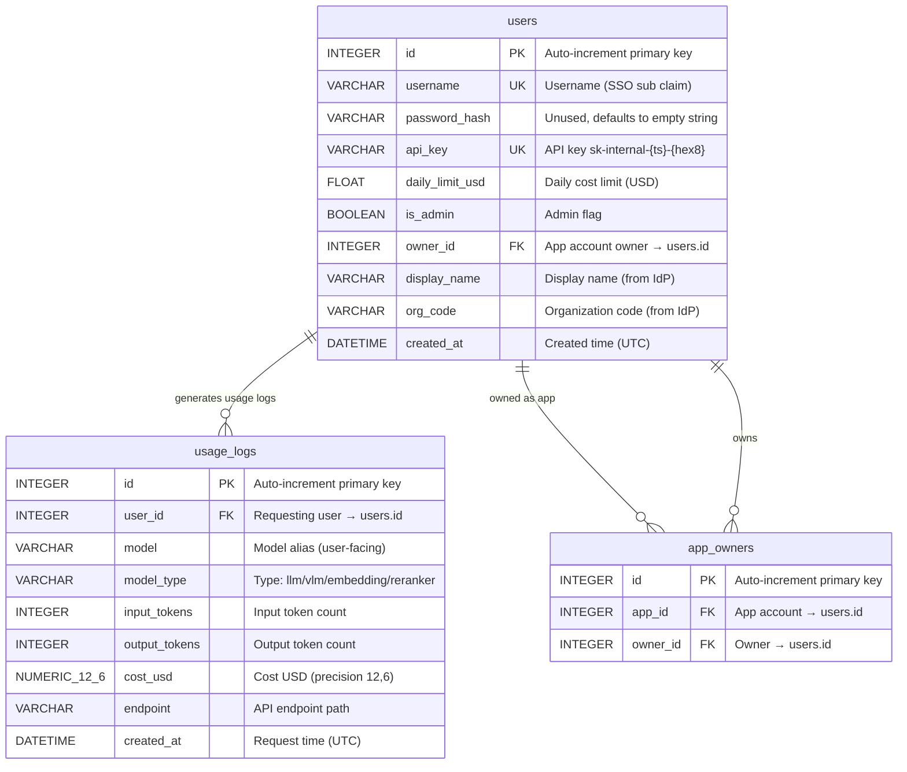
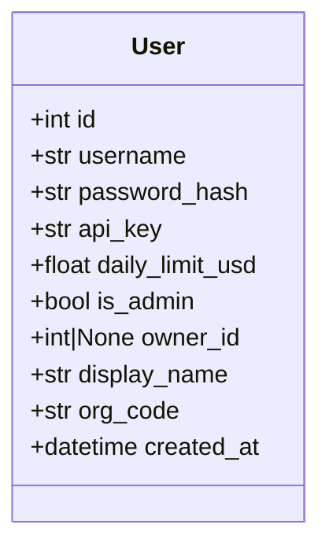
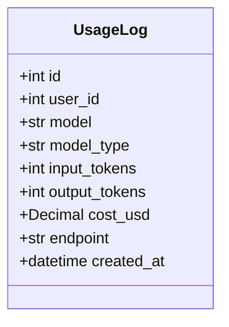

# Models — Database Model Definitions

[中文版](README.zh-TW.md)

Defines PostgreSQL table structures using [SQLModel](https://sqlmodel.tiangolo.com/) (SQLAlchemy + Pydantic integration).

## Files

| File | Description |
|---|---|
| `schema.py` | `User`, `AppOwner`, `UsageLog` — three ORM models |

## ER Diagram



## User Model

Maps to `users` table. Represents a human user or a programmatic app account.



### Field Details

| Field | Type | Constraints | Default | Description |
|---|---|---|---|---|
| `id` | `INTEGER` | PK, auto-increment | — | Primary key, auto-generated |
| `username` | `VARCHAR` | UNIQUE, INDEX | — | SSO `sub` claim. App accounts conventionally prefixed with `app_` |
| `password_hash` | `VARCHAR` | — | `""` | **Unused.** Legacy field kept for backward compatibility |
| `api_key` | `VARCHAR` | UNIQUE, INDEX | `_generate_api_key()` | Auto-generated, format `sk-internal-{unix_timestamp}-{8-char hex}`. Used for `/v1/*` API auth |
| `daily_limit_usd` | `FLOAT` | — | `10.0` | Daily spend limit (USD). API returns 429 when exceeded |
| `is_admin` | `BOOLEAN` | — | `False` | Admin flag in DB. **Note: Web UI admin access is determined by JWT scope, not this field** |
| `owner_id` | `INTEGER` | FK → `users.id`, INDEX, NULLABLE | `None` | App account owner. `None` means regular user account. Owner can view/manage owned apps on Dashboard |
| `display_name` | `VARCHAR` | — | `""` | Display name from IdP JWT `display_name` field. Auto-synced on each web login |
| `org_code` | `VARCHAR` | — | `""` | Org code from IdP JWT `org_code` field. Auto-synced on each web login. Shown in Admin user table |
| `created_at` | `DATETIME` | — | `datetime.now(UTC)` | Account creation time |

### API Key Generation

```python
def _generate_api_key() -> str:
    ts = int(datetime.now(timezone.utc).timestamp())
    short_hex = uuid.uuid4().hex[:8]
    return f"sk-internal-{ts}-{short_hex}"
```

Example: `sk-internal-1741651200-a1b2c3d4`

### User Type Distinctions

| Type | Criteria | Description |
|---|---|---|
| Regular user | `owner_id is None` and not prefixed with `app_` | Auto-created on SSO login |
| App account | `username.startswith("app_")` | Manually created by admin for programmatic use |
| Owned app | `owner_id is not None` | Bound to a specific user; owner can manage on Dashboard |

---

## UsageLog Model

Maps to `usage_logs` table. One record per API request.



### Field Details

| Field | Type | Constraints | Default | Description |
|---|---|---|---|---|
| `id` | `INTEGER` | PK, auto-increment | — | Primary key |
| `user_id` | `INTEGER` | Composite index | — | Requesting user ID. No FK constraint (avoids cascade issues on user deletion) |
| `model` | `VARCHAR` | — | `""` | Model alias requested by user (user-facing name, not real_model) |
| `model_type` | `VARCHAR` | — | `""` | Model type: `llm`, `vlm`, `embedding`, `vision_embedding`, `reranker`, `vision_reranker` |
| `input_tokens` | `INTEGER` | — | `0` | Input token count (`prompt_tokens`) |
| `output_tokens` | `INTEGER` | — | `0` | Output token count (`completion_tokens`). Usually 0 for Embedding/Reranker |
| `cost_usd` | `NUMERIC(12,6)` | NOT NULL | `0` | Calculated cost (USD). 6 decimal places. Based on `PRICING_MAP` per-1M-token pricing |
| `endpoint` | `VARCHAR` | — | `""` | API endpoint path, e.g. `/v1/chat/completions`, `/v1/embeddings`, `/v1/score`, `/responses` |
| `created_at` | `DATETIME` | Composite index | `datetime.now(UTC)` | Request time |

### Cost Formula

```
cost_usd = (input_tokens × input_price_per_1m + output_tokens × output_price_per_1m) / 1,000,000
```

Prices come from `config.toml` `[pricing]` section, matched by `model_type`.

### Indexes

| Index Name | Columns | Purpose |
|---|---|---|
| `ix_usage_user_date_cost` | `user_id`, `created_at`, `cost_usd` | Covering index. Daily limit queries use index-only scan without reading cost_usd from table |
| `ix_usage_created_at` | `created_at` | DAU stats, time-range queries |
