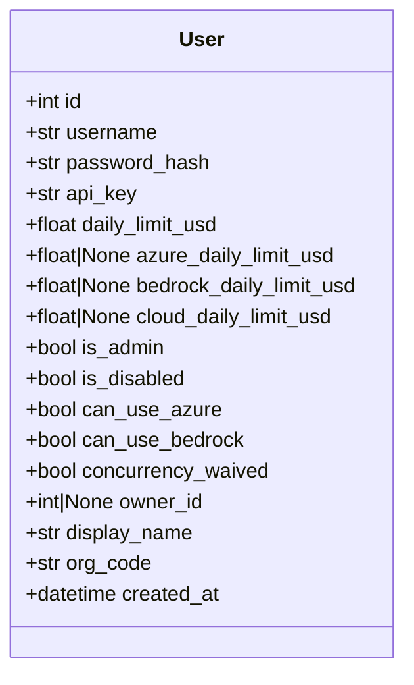
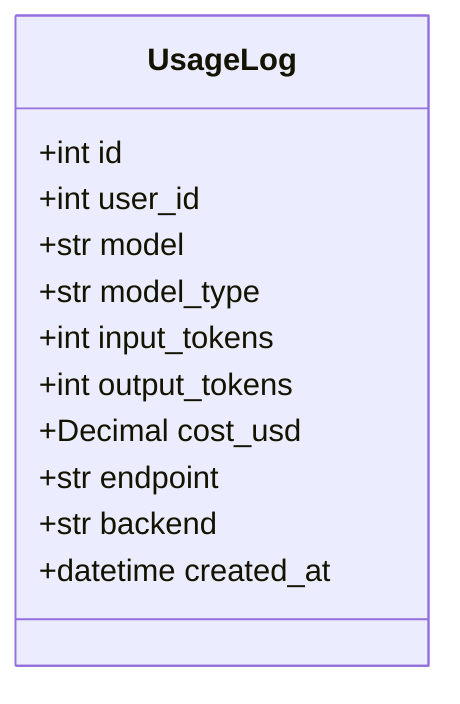

# Models — Database Model Definitions

[中文版](README.zh-TW.md)

Defines PostgreSQL table structures using [SQLModel](https://sqlmodel.tiangolo.com/) (SQLAlchemy + Pydantic integration).

## Files

| File | Description |
|---|---|
| `schema.py` | `User`, `AppOwner`, `UsageLog`, `UsageDaily`, `UsageRollupState`, `ScheduledJob`, `AnomalyEvent`, `ConcurrencyLease`, `IpAllowRule`, `AuditLog` — ten ORM models, plus helpers `service_account_clause()` / `service_account_names()` (who is a service account: the `is_service_account` column), `mask_api_key()` (key display in admin listings), `issue_api_key()` (the one way to (re)issue a key) and `is_legacy_api_key()` (keys older than the current format) |

## ER Diagram


```mermaid
erDiagram
    users {
        INTEGER id PK "Auto-increment primary key"
        VARCHAR username UK "Username (SSO sub claim)"
        VARCHAR password_hash "Unused, defaults to empty string"
        VARCHAR api_key UK "API key sk-internal-{hex64}"
        FLOAT daily_limit_usd "Daily cost limit (USD), 0 = $0 budget"
        FLOAT azure_daily_limit_usd "Retired, unread (nullable)"
        FLOAT bedrock_daily_limit_usd "Retired, unread (nullable)"
        FLOAT cloud_daily_limit_usd "Cloud cap Azure+Bedrock (NULL = [app] default)"
        BOOLEAN is_admin "Admin flag"
        BOOLEAN is_disabled "Disabled (rejects auth)"
        BOOLEAN can_use_azure "Allowed to use Azure models"
        BOOLEAN can_use_bedrock "Allowed to use Bedrock models"
        BOOLEAN concurrency_waived "Exempt from concurrency limit"
        DATETIME api_key_created_at "Current key issued (naive UTC, NULL = unknown)"
        DATETIME api_key_last_used_at "Current key last authenticated (≤ hourly)"
        INTEGER owner_id FK "Legacy app owner → users.id"
        VARCHAR display_name "Display name (from IdP)"
        VARCHAR org_code "Organization code (from IdP)"
        DATETIME created_at "Created time (UTC)"
    }

    usage_logs {
        INTEGER id PK "Auto-increment primary key"
        INTEGER user_id "Requesting user (no FK constraint)"
        VARCHAR model "Model alias (user-facing)"
        VARCHAR model_type "Type: llm/vlm/embedding/reranker/..."
        INTEGER input_tokens "Input token count"
        INTEGER output_tokens "Output token count"
        NUMERIC_12_6 cost_usd "Cost USD (precision 12,6)"
        VARCHAR endpoint "API endpoint path"
        VARCHAR backend "vllm / azure / bedrock"
        DATETIME created_at "Request time (UTC)"
    }

    app_owners {
        INTEGER id PK "Auto-increment primary key"
        INTEGER app_id FK "Service account → users.id"
        INTEGER owner_id FK "Owner → users.id"
    }

    anomaly_events {
        INTEGER id PK "Auto-increment primary key"
        VARCHAR scope "user:<id> or model:<alias>"
        VARCHAR rule "Detection rule"
        VARCHAR severity "info / warning / critical"
        INTEGER user_id FK "Denormalized user → users.id (nullable)"
        VARCHAR model "Denormalized model alias (nullable)"
        DATETIME window_start "Window start"
        DATETIME window_end "Window end"
        FLOAT observed "Observed value"
        FLOAT baseline "Baseline value"
        FLOAT ratio "observed / baseline"
        VARCHAR detail "JSON context"
        VARCHAR status "new / acknowledged / resolved"
        DATETIME created_at "Created time (UTC)"
        DATETIME updated_at "Last update (UTC)"
    }

    concurrency_leases {
        VARCHAR id PK "Lease ID"
        INTEGER user_id "Lease holder (no FK constraint)"
        VARCHAR worker_id "hostname:pid:boot token"
        VARCHAR endpoint "Endpoint label"
        DATETIME created_at "Acquired (naive UTC)"
        DATETIME expires_at "TTL expiry (naive UTC)"
    }

    usage_daily {
        DATE day PK "Asia/Taipei day"
        INTEGER user_id PK "No FK constraint; kept after account deletion"
        VARCHAR backend PK "vllm / azure / bedrock"
        VARCHAR model PK "Model alias"
        VARCHAR model_type PK "llm / vlm / embedding ..."
        VARCHAR endpoint PK "Endpoint label"
        BIGINT requests "Request count"
        BIGINT input_tokens "Input token sum"
        BIGINT output_tokens "Output token sum"
        NUMERIC cost_usd "Cost sum, NUMERIC(16,6)"
        BIGINT empty_turns "Requests with output_tokens <= 1"
    }

    usage_rollup_state {
        VARCHAR name PK "usage_daily"
        DATE rolled_through "Watermark: rolled through this day"
        DATETIME updated_at "Last advance"
    }

    scheduled_jobs {
        VARCHAR name PK "Job name"
        DATETIME last_started_at "Claim time (naive UTC)"
        DATETIME last_finished_at "Finish time (naive UTC)"
        VARCHAR last_status "running / ok / error"
        VARCHAR last_detail "Summary or error"
    }

    audit_log {
        INTEGER id PK "Auto-increment primary key"
        DATETIME created_at "When (naive UTC)"
        VARCHAR actor "Username from the JWT (not a FK)"
        VARCHAR method "HTTP method"
        VARCHAR route "Path template"
        VARCHAR path "Actual path"
        INTEGER status "Response status"
        VARCHAR client "Client address"
        VARCHAR detail "JSON: target, request, response, notes"
    }

    users ||--o{ usage_logs : "generates usage logs"
    users ||--o{ app_owners : "owned as app"
    users ||--o{ app_owners : "owns"
    users ||--o{ anomaly_events : "flagged in"
    users ||--o{ concurrency_leases : "holds in-flight slots"
    users ||--o{ usage_daily : "summarized per day"
```

`usage_logs.user_id` and `concurrency_leases.user_id` are logical references without a foreign-key constraint. The admin `delete_user` clears every row that references a user (`app_owners`, the legacy `users.owner_id`, `anomaly_events`, leases) before deleting it; add any new foreign key there too. `usage_logs` and `usage_daily` are deliberately kept: they are the billing and audit record, and the delete logs the id → account mapping.

## User Model

Maps to `users` table. Represents a human user or a programmatic service account.


```mermaid
classDiagram
    class User {
        +int id
        +str username
        +str password_hash
        +str api_key
        +float daily_limit_usd
        +float|None azure_daily_limit_usd
        +float|None bedrock_daily_limit_usd
        +float|None cloud_daily_limit_usd
        +bool is_admin
        +bool is_disabled
        +bool can_use_azure
        +bool can_use_bedrock
        +bool concurrency_waived
        +int|None owner_id
        +str display_name
        +str org_code
        +datetime created_at
    }
```

### Field Details

| Field | Type | Constraints | Default | Description |
|---|---|---|---|---|
| `id` | `INTEGER` | PK, auto-increment | — | Primary key, auto-generated |
| `username` | `VARCHAR` | UNIQUE, INDEX | — | SSO `sub` claim for a person; any name for a service account (older ones are `app_*`; the name decides nothing, see `is_service_account`) |
| `password_hash` | `VARCHAR` | — | `""` | **Unused.** Legacy field kept for backward compatibility |
| `api_key` | `VARCHAR` | UNIQUE, INDEX | `_generate_api_key()` | Auto-generated, format `sk-internal-` + 64 hex (256 random bits). Keys issued earlier (`sk-internal-{unix_timestamp}-{8-char hex}`) keep working; `is_legacy_api_key` flags them. Used for API auth. Admin listings show `mask_api_key(...)` |
| `daily_limit_usd` | `FLOAT` | — | `10.0` | Daily spend limit (USD) for all backends. API returns 429 when exceeded. Always finite and ≥ 0: **`0` is a $0 budget, not unlimited**. SSO-created users get `[app].default_daily_limit_usd` |
| `azure_daily_limit_usd` | `FLOAT` | NULLABLE | `None` | **Retired, unread.** Former per-user Azure sub-limit; kept until a migration drops it. The admin API answers 400 to this field |
| `bedrock_daily_limit_usd` | `FLOAT` | NULLABLE | `None` | **Retired, unread.** Former per-user Bedrock sub-limit; same status as above |
| `cloud_daily_limit_usd` | `FLOAT` | NULLABLE | `None` | The user's cloud cap: Azure + Bedrock spend together, per day. **NULL follows `[app].cloud_daily_limit_usd`**, not "no cap"; a value (`0` included, which refuses cloud) replaces it. Read only through `deps.effective_cloud_limit`. Applies only to users with Azure or AWS access |
| `is_admin` | `BOOLEAN` | — | `False` | **Retired.** Who is an admin is the AuthCenter token's `admin` scope. Nothing grants anything from this column: API-key auth clears the attribute, the admin API 400s the field, no listing shows it. `get_web_user` reuses the attribute for one request to carry the scope to the pages |
| `is_disabled` | `BOOLEAN` | — | `False` | When `True`, both API key auth and JWT web auth raise `AccountDisabledError` (HTML page or JSON 403). On the web UI an admin by the token's scope is let in regardless; on the API nobody is. Toggled via `POST /admin/users/{id}/toggle-disable` (refuses self-disable) |
| `can_use_azure` | `BOOLEAN` | — | `False` | Gates `/azure/v1/*` (`deps.require_azure_access`) and unified `/v1/*` dispatch to Azure aliases. Toggled via `POST /admin/users/{id}/toggle-azure` |
| `can_use_bedrock` | `BOOLEAN` | — | `False` | Gates `/aws/v1/*` (`deps.require_bedrock_access`) and unified `/v1/*` dispatch to Bedrock aliases. Toggled via `POST /admin/users/{id}/toggle-bedrock` |
| `concurrency_waived` | `BOOLEAN` | — | `False` | Exempt from the concurrency limit (`[app].concurrency_limit_*`); the only exemption there is. Service accounts are created waived. Toggled via `POST /admin/users/{id}/toggle-concurrency-waive` |
| `is_service_account` | `BOOLEAN` | — | `False` | An account for a program rather than a person (formerly "app account", then recognised by an `app_` name). Decides everything that tells the two apart: the admin's two tables, the per-person figures, mail, the guardrail scope, and that nobody signs in under its name |
| `owner_id` | `INTEGER` | FK → `users.id`, INDEX, NULLABLE | `None` | **Legacy** single-owner column, superseded by `app_owners`. Migration `d5a2c3e67f04` copied it without clearing it, so old service accounts may still point at their original owner |
| `display_name` | `VARCHAR` | — | `""` | Display name from IdP JWT `display_name` field. Auto-synced on each web login |
| `org_code` | `VARCHAR` | — | `""` | Org code from IdP JWT `org_code` field. Auto-synced on each web login. Shown in Admin user table |
| `created_at` | `DATETIME` | — | `datetime.now(UTC)` | Account creation time |
| `api_key_created_at` | `DATETIME` | nullable | `datetime.now(UTC)` (naive) | When the current key was issued; reset by `issue_api_key`. NULL = unknown (backfilled from old-format keys only) |
| `api_key_last_used_at` | `DATETIME` | nullable | — | Last successful auth with the key, **naive UTC**, at most hourly (`deps._record_key_use`); NULL = never. Backfilled from `usage_logs` |

### API Key Generation

```python
def _generate_api_key() -> str:
    return API_KEY_PREFIX + secrets.token_hex(32)   # "sk-internal-" + 64 hex
```

Example: `sk-internal-3f9c…` (76 characters). Keys issued before this format, `sk-internal-1741651200-a1b2c3d4`, still authenticate (auth is an exact lookup); the dashboard asks their holders to regenerate and the admin Users filter **Older-format API key** lists them.

### User Type Distinctions

| Type | Criteria | Description |
|---|---|---|
| Regular user | `is_service_account = False` | Auto-created on SSO login |
| Service account (formerly "app account") | `is_service_account = True` (`schema.service_account_clause()` in SQL) | Created by an admin for a program, under any name. API key only: an SSO sign-in under its name is refused. Created with `concurrency_waived = True`. Migration `b2f7c9a41e68` marked the existing `app_*` accounts |
| Owned app | Has `app_owners` rows with `app_id = id` | Bound to one or more users; owners can manage it on Dashboard |

---

## AppOwner Model

Maps to `app_owners` table. Many-to-many: which users own which service accounts.

| Field | Type | Constraints | Default | Description |
|---|---|---|---|---|
| `id` | `INTEGER` | PK, auto-increment | — | Primary key |
| `app_id` | `INTEGER` | FK → `users.id`, INDEX | — | The service account |
| `owner_id` | `INTEGER` | FK → `users.id`, INDEX | — | The owning user |

---

## UsageLog Model

Maps to `usage_logs` table. One record per billable API request (written by `_log_usage`; debug and metadata calls such as `render`, `tokenize`, `count_tokens` are not logged). This is the billing and audit record.


```mermaid
classDiagram
    class UsageLog {
        +int id
        +int user_id
        +str model
        +str model_type
        +int input_tokens
        +int output_tokens
        +Decimal cost_usd
        +str endpoint
        +str backend
        +datetime created_at
    }
```

### Field Details

| Field | Type | Constraints | Default | Description |
|---|---|---|---|---|
| `id` | `INTEGER` | PK, auto-increment | — | Primary key |
| `user_id` | `INTEGER` | Composite index | — | Requesting user ID. No FK constraint: the rows outlive a deleted account (`delete_user` keeps them) |
| `model` | `VARCHAR` | — | `""` | Model alias requested by user (user-facing name, not real_model) |
| `model_type` | `VARCHAR` | — | `""` | Model type: `llm`, `vlm`, `embedding`, `vision_embedding`, `reranker`, `vision_reranker`, `systemone` |
| `input_tokens` | `INTEGER` | — | `0` | Input token count (`prompt_tokens`) |
| `output_tokens` | `INTEGER` | — | `0` | Output token count (`completion_tokens`). Usually 0 for Embedding/Reranker, always 0 for System One |
| `cost_usd` | `NUMERIC(12,6)` | NOT NULL | `0` | Calculated cost (USD). 6 decimal places. Based on per-1M-token pricing (see below) |
| `endpoint` | `VARCHAR` | — | `""` | API endpoint label, e.g. `/v1/chat/completions`, `/v1/embeddings`, `/v1/score`, `/azure/v1/responses` |
| `backend` | `VARCHAR` | NOT NULL, server default `'vllm'` | `"vllm"` | Downstream that served the request: `vllm` (on-prem), `azure` or `bedrock`. Splits cloud spend from on-prem spend for the cloud cap, dashboard and usage export |
| `created_at` | `DATETIME` | Composite index | `datetime.now(UTC)` | Request time |

### Cost Formula

```
cost_usd = (uncached_input_tokens × input_price_per_1m
            + cached_input_tokens × cached_input_price_per_1m
            + output_tokens × output_price_per_1m) / 1,000,000
```

Prices come from `config.toml`: the model entry's own override, else `[pricing.<type>]`, else `[pricing]`. Cached input tokens bill at `cached_input_price_per_1m` only when that price is configured and the backend reports cache hits; otherwise all input bills at `input_price_per_1m`.

### Indexes

| Index Name | Columns | Purpose |
|---|---|---|
| `ix_usage_user_date_cost` | `user_id`, `created_at`, `cost_usd` | Covering index. Daily limit queries use index-only scan without reading cost_usd from table |
| `ix_usage_created_at` | `created_at` | DAU stats, time-range queries |

---

## AnomalyEvent Model

Maps to `anomaly_events` table. Findings from the hourly usage-anomaly scan the gateway runs (`app/services/anomaly_scan.py`; `scripts/scan_anomalies.py` runs it by hand). Detection only: nothing here blocks or throttles a request.

One row per `(scope, rule, window_start)`: the scan upserts, so re-running a window is idempotent and an ongoing anomaly updates one row (`window_end` / `observed` grow). Alert side-channels must fire only when a row is **created**, never on updates.

| Field | Type | Constraints | Default | Description |
|---|---|---|---|---|
| `id` | `INTEGER` | PK, auto-increment | — | Primary key |
| `scope` | `VARCHAR` | UNIQUE (with `rule`, `window_start`) | — | `user:<id>` for per-account rules, `model:<alias>` for model-level rules |
| `rule` | `VARCHAR` | UNIQUE (with `scope`, `window_start`) | — | `cost_spike`, `off_hours`, `burst_rate`, `behavior_shift`, `empty_turn_rate` |
| `severity` | `VARCHAR` | — | `"warning"` | `info`, `warning`, `critical` |
| `user_id` | `INTEGER` | FK → `users.id`, INDEX, NULLABLE | `None` | Denormalized copy of the user in `scope`, for joins and display |
| `model` | `VARCHAR` | NULLABLE | `None` | Denormalized model alias |
| `window_start` | `DATETIME` | UNIQUE (with `scope`, `rule`) | — | Start of the detection window |
| `window_end` | `DATETIME` | — | — | End of the detection window |
| `observed` | `FLOAT` | — | `0.0` | Observed value |
| `baseline` | `FLOAT` | — | `0.0` | Baseline value |
| `ratio` | `FLOAT` | — | `0.0` | Observed / baseline |
| `detail` | `VARCHAR` | — | `"{}"` | JSON: summary + structured context |
| `status` | `VARCHAR` | — | `"new"` | `new` → `acknowledged` → `resolved` |
| `created_at` | `DATETIME` | — | `datetime.now(UTC)` | Row creation time |
| `updated_at` | `DATETIME` | — | `datetime.now(UTC)` | Last upsert time |

### Indexes and Constraints

| Name | Columns | Purpose |
|---|---|---|
| `uq_anomaly_scope_rule_window` | `scope`, `rule`, `window_start` | UNIQUE — upsert key |
| `ix_anomaly_status_created` | `status`, `created_at` | Admin listing by status |
| `ix_anomaly_events_user_id` | `user_id` | Per-user lookup and user deletion |

---

## ConcurrencyLease Model

Maps to `concurrency_leases` table. One row per in-flight limited request holding a concurrency slot (`app/services/concurrency.py`). Inserted when a limited request starts, deleted when its response (stream included) has been fully sent. Leases of dead workers are removed by the per-worker sweep (dead pid on this host, recycled pid) or, failing that, once `expires_at` passes; the owning worker pushes `expires_at` forward every heartbeat.

| Field | Type | Constraints | Default | Description |
|---|---|---|---|---|
| `id` | `VARCHAR` | PK | — | Lease ID |
| `user_id` | `INTEGER` | Composite index | — | Lease holder. No FK constraint: rows are short-lived and `delete_user` removes them explicitly |
| `worker_id` | `VARCHAR` | INDEX | — | `<hostname>:<pid>:<boot token>` of the owning worker |
| `endpoint` | `VARCHAR` | — | `""` | Endpoint label |
| `created_at` | `DATETIME` | — | — | Acquisition time, **naive UTC** |
| `expires_at` | `DATETIME` | Composite index | — | TTL expiry, **naive UTC** |

Timestamps are naive UTC (unlike the aware values other tables use) so a PostgreSQL session `TimeZone` can never shift them between write and compare.

### Indexes

| Index Name | Columns | Purpose |
|---|---|---|
| `ix_concurrency_user_expires` | `user_id`, `expires_at` | Count a user's live leases |
| `ix_concurrency_leases_worker_id` | `worker_id` | Heartbeat renewal and dead-worker sweep |

---

## UsageDaily Model

Maps to `usage_daily` table. Per-local-day (Asia/Taipei) rollup of `usage_logs`, written only by the gateway's background rollup (`app/services/usage_rollup.py`) for closed days. Reports read closed days here and the rest from `usage_logs` through `usage_rollup.aggregate`. See [docs/architecture.md](../../docs/architecture.md#daily-usage-rollup-appservicesusage_rolluppy).

| Field | Type | Constraints | Default | Description |
|---|---|---|---|---|
| `day` | `DATE` | PK | — | Asia/Taipei calendar day |
| `user_id` | `INTEGER` | PK | — | No FK constraint (like `usage_logs`); kept when the account is deleted |
| `backend` | `VARCHAR` | PK | — | `vllm`, `azure`, `bedrock` |
| `model` | `VARCHAR` | PK | — | Model alias |
| `model_type` | `VARCHAR` | PK | — | `llm`, `vlm`, `embedding`, ... |
| `endpoint` | `VARCHAR` | PK | — | Endpoint label |
| `requests` | `BIGINT` | — | `0` | Request count |
| `input_tokens` / `output_tokens` | `BIGINT` | — | `0` | Token sums |
| `cost_usd` | `NUMERIC(16,6)` | — | `0` | Cost sum |
| `empty_turns` | `BIGINT` | — | `0` | Requests with `output_tokens <= 1` |

| Index Name | Columns | Purpose |
|---|---|---|
| `usage_daily_pkey` | `day`, `user_id`, `backend`, `model`, `model_type`, `endpoint` | Date-range reads |
| `ix_usage_daily_user_day` | `user_id`, `day` | Per-user reads (dashboard) |

## UsageRollupState Model

Maps to `usage_rollup_state` table. One row (`name = "usage_daily"`) holding `rolled_through` (`DATE`): every day up to it is in `usage_daily`, with no gaps. No row means the rollup has not run yet, and reports read `usage_logs` only.

## ScheduledJob Model

Maps to `scheduled_jobs` table. One row per in-gateway periodic job (anomaly scan, usage-log retention; `app/services/scheduler.py`): `name` (PK), `last_started_at`, `last_finished_at` (naive UTC), `last_status` (`running` / `ok` / `error`), `last_detail`. Workers claim a run with a conditional UPDATE of `last_started_at`, so each job runs once per interval across every worker and host.

## IpAllowRule Model

Maps to `ip_allow_rules` table: the API IP allowlist (`app/services/ip_allowlist.py`). `cidr`, `label`, `usernames` / `org_codes` (JSON lists; both empty = every account), `created_by` (a username, not a foreign key), optional `starts_at` / `expires_at` (naive UTC; no end = permanent), `created_at`. Usernames and org codes, never user ids, so deleting an account never touches this table.

## Client rule tables

Four tables behind the admin *Clients* tab (`app/services/client_rules.py`; see Client rules in `docs/architecture.md`). They hold usernames and check ids, never foreign keys, so deleting an account or retiring a check leaves them alone.

| Table (model) | One row per | Holds |
|---|---|---|
| `client_rule_settings` (`ClientRuleSetting`) | built-in check an admin has saved (`rule_id`, e.g. `CC001`) | on / off, action, title, message, the patch for everyone and for Azure / AWS accounts, mail subject, automatic mail and its repeat. No row = the defaults in code. Never any part of what the check detects |
| `client_violations` (`ClientViolation`) | check × account | first / last seen, Claude Code version, the day of the last terminal reminder, mail state (`mailed_at`, `mail_attempted_at`, `mail_error`, `mail_requested_at`), `resolved_at` (the account said it applied the fix) |
| `client_versions` (`ClientVersion`) | account × Claude Code version | when it was last seen (from the User-Agent) |
| `client_mail_log` (`ClientMailLog`) | mail attempt | when, account, address, subject, the checks it covered, why (`requested` / `automatic` / `test`), sent or failed with the error, the admin behind a test. Append-only; no mail body |

## AuditLog Model

Maps to `audit_log` table: the trail of Web UI / admin actions written by `AuditMiddleware` (`app/services/audit.py`). One row per POST / PUT / PATCH / DELETE under `/admin` and `/dashboard` (whatever the outcome), per full API key revealed and per export.

| Column | Type | Description |
|---|---|---|
| `id` | `INTEGER` | Primary key |
| `created_at` | `DATETIME` | When, **naive UTC** (indexed, and `(actor, created_at)`) |
| `actor` | `VARCHAR` | JWT `sub` (username); empty when unauthenticated. Not a foreign key: deleting an account keeps its trail |
| `method`, `route`, `path` | `VARCHAR` | HTTP method, path template (`/admin/users/{user_id}/limit`) and actual path |
| `status` | `INTEGER` | Response status; 500 when the handler raised |
| `client` | `VARCHAR` | `request.client.host` |
| `detail` | `VARCHAR` (JSON) | `target` (the account the path names, looked up before the handler), `request` (submitted fields), `response` (small JSON reply), handler notes such as `config_changes`. Credential-like keys are `<redacted>` |

Append-only: the app never updates or deletes a row, and on PostgreSQL triggers refuse UPDATE, DELETE and TRUNCATE (migration `07899844c700`). No retention.
