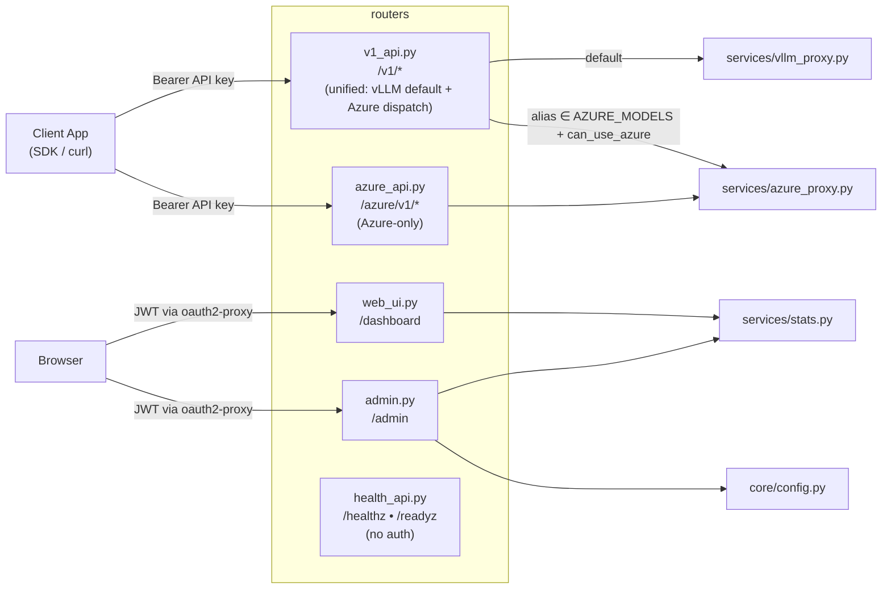

# Routers — API Endpoints and Page Routes

[中文版](README.zh-TW.md)

Defines FastAPI routes: the unified `/v1/*` public API, the Azure-only `/azure/v1/*` API, the Bedrock-only `/aws/v1/*` API, Web UI pages, Admin management, and the unauthenticated health probes.

## Module Overview



---

## `v1_api.py` — Unified `/v1/*` API (OpenAI- and Anthropic-compatible)

**Auth**: `deps.get_current_user` (API key + daily limit check)

`v1_api.py` is the main public entry. It serves the vLLM backend by default, and dispatches chat / messages / count_tokens to Azure when the requested `model` alias is configured under `[azure_models.*]` AND the caller has `can_use_azure` (or is admin). One base URL surfaces both backends to clients like Claude Code's model picker. Routes are also exposed without the `/v1` prefix to accommodate clients (Roo Code, Cline, Cursor, Anthropic SDK) whose base URL omits it.

### Endpoints

| Method | Path(s) | Description | Proxy Method | Allowed Types |
|---|---|---|---|---|
| `GET` | `/v1/models`, `/models` | List models (LLM/VLM only). Azure aliases merged in for users with `can_use_azure` (admins bypass) | Direct response | `llm`, `vlm` |
| `POST` | `/v1/chat/completions`, `/chat/completions` | Chat completion generation | `vllm_forward_chat_completions` (vLLM) / `azure_forward_chat_completions` (Azure) | `llm`, `vlm` |
| `POST` | `/v1/responses`, `/responses` | Responses API | `vllm_forward_responses` | `llm`, `vlm` |
| `POST` | `/v1/embeddings`, `/embeddings` | Text embeddings | `vllm_forward_simple_request` | `embedding`, `vision_embedding` |
| `POST` | `/v1/rerank`, `/rerank` | Document reranking | `vllm_forward_simple_request` | `reranker`, `vision_reranker` |
| `POST` | `/v1/score`, `/score` | Relevance scoring | `vllm_forward_simple_request` | `reranker`, `vision_reranker` |
| `POST` | `/v1/messages`, `/messages` | Anthropic Messages (translates to OpenAI; streams `reasoning_content` as `thinking` blocks; emits SSE `ping` every 10 s of downstream silence) | `vllm_forward_messages` (vLLM) / `azure_forward_messages` (Azure) | `llm`, `vlm` |
| `POST` | `/v1/messages/count_tokens`, `/messages/count_tokens` | Anthropic token counting (forwards to vLLM `/tokenize`, falls back to chars/4; Azure path uses chars/4 estimate) | `vllm_forward_count_tokens` (vLLM) / `azure_forward_count_tokens` (Azure) | `llm`, `vlm` |
| `POST` | `/v1/tokenize`, `/tokenize` | vLLM-native pass-through tokenize (no Azure path — Azure has no tokenize endpoint) | `vllm_forward_tokenize` | `llm`, `vlm` |
| `POST` | `/v1/chat/completions/render`, `/chat/completions/render` | vLLM-native pass-through render — chat template applied, nothing generated (debug aid; on-prem vLLM only, no Azure/Bedrock path). The only route carrying a documented request body in `/docs`, declared via `openapi_extra` so nothing is validated away | `vllm_forward_render` | `llm`, `vlm` |

### Dispatch logic

Helpers `_peek_model_alias` + `_route_to_azure` determine routing:

```
alias in AZURE_MODELS AND (can_use_azure or is_admin) → Azure path
alias in AZURE_MODELS AND no permission              → vLLM path (silent fallback via _resolve_model)
alias not in AZURE_MODELS                            → vLLM path
```

The "Azure alias from non-Azure user → vLLM fallback" branch matches the gateway's longstanding liberal alias handling. Azure existence is hidden via the per-user `/v1/models` filter rather than a 404 at request time. `AZURE_MODELS` and `MODEL_ROUTING` must not share alias names — `_build_config` raises `ValueError` at startup if they do.

### Proxy Methods

| Method | Streaming | Use Case | Features |
|---|---|---|---|
| `vllm_forward_chat_completions` | stream + non-stream | Chat Completions | SSE parsing, auto-injects `stream_options.include_usage` |
| `vllm_forward_simple_request` | non-stream only | Embeddings, Rerank, Score | 120s timeout, handles reranker total_tokens reporting |
| `vllm_forward_responses` | stream + non-stream | Responses API | Raw pass-through, only replaces model field |
| `vllm_forward_messages` | stream + non-stream | Anthropic Messages | Anthropic→OpenAI request, OpenAI→Anthropic response (uses `services/anthropic_adapter.py`) |
| `vllm_forward_count_tokens` | non-stream | `count_tokens` | Forwards to vLLM `/tokenize`; falls back to chars/4 if downstream tokenizer unavailable; not billed |
| `vllm_forward_tokenize` | non-stream | `/tokenize` | vLLM-native pass-through; not billed |
| `vllm_forward_render` | non-stream | `/chat/completions/render` | vLLM-native pass-through; applies the same reasoning-dialect alignment as chat completions, swaps the alias back onto the echoed `model`; not billed |

### Common Behavior

All proxy methods share `_resolve_model()` for health-aware routing:

```
1. Exact match + server alive → use directly
2. Server DOWN → use configured fallback of same type
3. No match found → use any alive server of same type
4. No alive servers → best-effort try any server of compatible type
```

When fallback occurs, the response includes an `X-Model-Fallback` header explaining the reason.

---

## `azure_api.py` — Azure OpenAI Compatibility

**Auth**: `deps.require_azure_access` (wraps `get_current_user` and additionally checks `user.can_use_azure`; admins bypass) — same gateway API key + daily limit as `/v1/*`, plus a per-user Azure access flag

Same client API key, same usage logging, same observability as the `/v1/*` path. Only the downstream URL/header conventions differ — handled by `services/azure_proxy.py`. Azure deployments are configured under `[azure_models.<alias>]` in `config.toml`. Users without `can_use_azure` (and not admin) get 403 with `"Azure access not granted. Contact your administrator."`.

### Endpoints

| Method | Path | Description | Proxy Method |
|---|---|---|---|
| `GET` | `/azure/v1/models`, `/azure/models` | List configured Azure deployments (always Azure-only, regardless of `/v1/models` filter) | Direct response |
| `POST` | `/azure/v1/chat/completions`, `/azure/chat/completions` | Chat completion via Azure deployment | `azure_forward_chat_completions` |
| `POST` | `/azure/v1/responses`, `/azure/responses` | Pure pass-through to Azure's Responses API (only mutates `body.model`) | `azure_forward_responses` |
| `POST` | `/azure/v1/messages`, `/azure/messages` | Anthropic Messages → Azure (shared `anthropic_adapter`; same `thinking`-block translation and 10 s SSE `ping` heartbeat as the vLLM path) | `azure_forward_messages` |
| `POST` | `/azure/v1/messages/count_tokens`, `/azure/messages/count_tokens` | Token counting (chars/4 estimate; Azure has no tokenize endpoint) | `azure_forward_count_tokens` |

There is intentionally **no** `/azure/v1/embeddings` — the Responses API doesn't cover embeddings; configure embedding models on a vLLM backend instead.

### Azure-specific behavior

- URL pattern: `{endpoint}/openai/deployments/{deployment}/{path}?api-version=...`
- Header: `api-key: <key>` (not `Authorization: Bearer`)
- Body's `model` field is stripped before forwarding (Azure routes by deployment in URL)
- No `_resolve_model` / fallback — alias maps directly to a deployment
- OpenAI-shape responses pass through unchanged; Anthropic responses use the same translator as the vLLM path
- `_calc_cost` is decoupled — `azure_proxy` looks up `AZURE_MODELS` and passes the route dict to `_log_usage(route=...)`

---

## `web_ui.py` — User Dashboard

**Auth**: `auth.get_web_user` (JWT scope must include `read` or `admin`)

### Endpoints

| Method | Path | Description |
|---|---|---|
| `GET` | `/` | Welcome page: API guide, available models, quick start |
| `GET` | `/dashboard` | Dashboard page: usage stats, trend charts, server status, app accounts |
| `POST` | `/dashboard/refresh-key` | Regenerate own API key, returns JSON `{ok, api_key}` |
| `POST` | `/dashboard/app/{app_id}/refresh-key` | Regenerate owned app account's API key (must be owner) |

### Dashboard Data Sources

| Section | Data Function | Description |
|---|---|---|
| Stats Cards | `get_user_monthly_summary()` | Current month requests, cost, tokens |
| Usage Trend | `get_daily_trends()` | Daily requests/cost for last 30 days |
| My App Accounts | `get_owned_apps_summary()` | Owned app accounts' monthly usage |
| System Status | `MODEL_ROUTING` + `is_alive()` | Server health grouped by type |

---

## `admin.py` — Admin Panel + Admin API

**Auth**: Router-level `Security(get_web_user, scopes=["admin"])` — all `/admin/*` endpoints (including REST API) use JWT auth

### Web UI Endpoints

| Method | Path | Description |
|---|---|---|
| `GET` | `/admin` | Admin home: usage summary, DAU trends, department usage, leaderboards, user management. Supports pagination (`?limit=15&offset=0&app_limit=15&app_offset=0`) and server-side search (`?q=keyword`, ILIKE on username/display_name/org_code) |
| `POST` | `/admin/users/create` | Create app account (form submit, username auto-prefixed with `app_`) |
| `POST` | `/admin/users/{id}/limit` | Update user daily limit (form submit) |
| `POST` | `/admin/users/{id}/delete` | Delete user and their usage logs (cannot delete self) |
| `POST` | `/admin/users/{id}/refresh-key` | Regenerate any user's API key, returns JSON |
| `POST` | `/admin/users/{id}/toggle-disable` | Flip the user's `is_disabled` flag. Refuses to disable yourself (400). Allows enabling yourself |
| `POST` | `/admin/users/{id}/toggle-azure` | Flip the user's `can_use_azure` flag (gates `/azure/v1/*` access) |
| `POST` | `/admin/default-limit` | Set the default daily limit (USD). Persists to `[app].default_daily_limit_usd` in `config.toml` and bulk-bumps any user with `0 < daily_limit_usd < new_floor` up to the floor (unlimited users with `daily_limit_usd = 0` are never modified) |
| `GET` | `/admin/models` | Model config page (SPA, loads data via API) |

### Admin REST API (JWT auth, requires admin scope)

| Method | Path | Description |
|---|---|---|
| `GET` | `/admin/users` | List all users (includes `display_name`, `org_code`) |
| `POST` | `/admin/users` | Create user (JSON body: `username`, `daily_limit_usd`, `is_admin`, `owner_ids`) |
| `PATCH` | `/admin/users/{id}` | Update user (`daily_limit_usd`, `is_admin`, `owner_ids`) |

### Model Config API (JWT auth, requires admin scope)

| Method | Path | Description |
|---|---|---|
| `GET` | `/admin/api/config` | Get `config.toml` contents (models, pricing, fallback, azure_models) |
| `PUT` | `/admin/api/config` | Save config to `config.toml` and reload immediately |

---

## `health_api.py` — Liveness & Readiness Probes

**Auth**: none — deliberately. Probes come from nginx, an external load
balancer, or a container runtime, none of which carry an API key or an SSO
session. Neither endpoint reveals anything an unauthenticated caller could
not learn by watching the service respond at all.

| Method | Path | Description | Codes |
|---|---|---|---|
| `GET` | `/healthz` | Liveness. Zero I/O — answers as long as the process is up and the event loop is turning. | always `200` |
| `GET` | `/readyz` | Readiness. Round-trips `SELECT 1` against the database; reports the vLLM health-cache counts as information. | `200` / `503` |

`/readyz` gates on the **database only**. The vLLM health cache is reported
but never fails the probe: it is filled by a background loop that has not
run yet during the first ~30 s after boot (a fresh worker would report
itself unready), and a fleet-wide downstream outage would pull every
Gateway instance out of the load balancer at once — turning a degraded
service into a total one.

Both routes are `include_in_schema=False`, so they stay out of the OpenAPI
document.

---

## Route & Auth Reference

```mermaid
graph TD
    subgraph "API Key Auth (deps.py)"
        V1["/v1/* (+ no-/v1 aliases)<br/>models • chat/completions • embeddings<br/>rerank • score • responses<br/>messages • messages/count_tokens • tokenize<br/>chat/completions/render<br/>(vLLM default + Azure dispatch on can_use_azure)"]
        Azure["/azure/v1/* (+ /azure/* aliases)<br/>models • chat/completions • responses<br/>messages • messages/count_tokens<br/>(Azure-only, require_azure_access)"]
    end

    subgraph "No Auth (health_api.py)"
        Probes["/healthz • /readyz<br/>(liveness • readiness)"]
    end

    subgraph "JWT Auth (auth.py via oauth2-proxy)"
        Dashboard["/ • /dashboard<br/>Security: read scope"]
        Admin["/admin/*<br/>Security: admin scope<br/>(Web UI + REST API + Model Config + Monitor)"]
    end

    V1 -->|get_current_user| DB["DB: users.api_key"]
    Azure -->|require_azure_access<br/>(get_current_user + can_use_azure)| DB
    Dashboard -->|get_web_user| JWT["JWT: sub → users.username"]
    Admin -->|get_web_user| JWT
```
