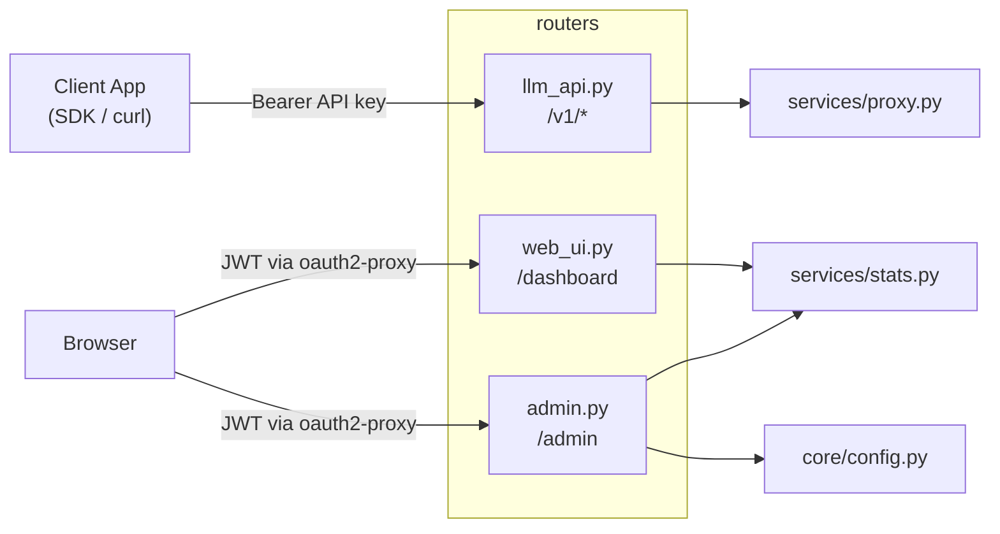
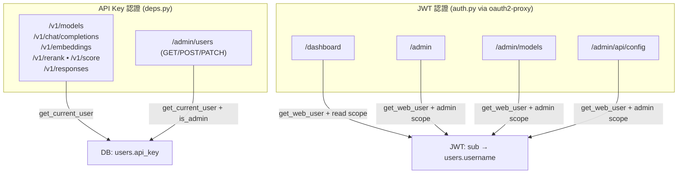

# Routers — API 端點與頁面路由

定義 FastAPI 路由，分為三個模組：API 端點、Web UI 頁面、Admin 管理。

## 模組總覽



---

## `llm_api.py` — OpenAI 相容 API

**認證**：`deps.get_current_user`（API key + daily limit 檢查）

### 端點

| 方法 | 路徑 | 說明 | Proxy 方式 | 允許類型 |
|---|---|---|---|---|
| `GET` | `/v1/models` | 列出所有可用模型 | 直接回傳 | — |
| `POST` | `/v1/chat/completions` | Chat 對話生成 | `forward_request` | `llm`, `vlm` |
| `POST` | `/v1/responses` | Responses API | `forward_to_path` | `llm`, `vlm` |
| `POST` | `/v1/embeddings` | 文字向量嵌入 | `forward_simple_request` | `embedding`, `vision_embedding` |
| `POST` | `/v1/rerank` | 文件重排序 | `forward_simple_request` | `reranker`, `vision_reranker` |
| `POST` | `/v1/score` | 相關性評分 | `forward_simple_request` | `reranker`, `vision_reranker` |

### 三種 Proxy 方式

| 方式 | 串流 | 用途 | 特色 |
|---|---|---|---|
| `forward_request` | stream + non-stream | Chat Completions | SSE 解析、自動注入 `stream_options.include_usage` |
| `forward_simple_request` | non-stream only | Embeddings, Rerank, Score | 120s timeout，處理 reranker 的 total_tokens 回報 |
| `forward_to_path` | stream + non-stream | Responses API | Raw pass-through，僅替換 model 欄位 |

### 共通行為

所有 proxy 方式共享 `_resolve_model()` 做健康感知路由：

```
1. 精確匹配 + 伺服器存活 → 直接使用
2. 伺服器 DOWN → 使用同類型的 configured fallback
3. 找不到匹配 → 使用同類型的任意存活伺服器
4. 無存活伺服器 → best-effort 嘗試任意同類型伺服器
```

Fallback 發生時，回應會帶 `X-Model-Fallback` header 說明原因。

---

## `web_ui.py` — 使用者 Dashboard

**認證**：`auth.get_web_user`（JWT scope 需含 `read` 或 `admin`）

### 端點

| 方法 | 路徑 | 說明 |
|---|---|---|
| `GET` | `/` | Welcome 首頁：API 使用指南、可用模型、快速上手 |
| `GET` | `/dashboard` | Dashboard 頁面：用量統計、趨勢圖、伺服器狀態、App 帳號 |
| `POST` | `/dashboard/refresh-key` | 重新產生自己的 API key，回傳 JSON `{ok, api_key}` |
| `POST` | `/dashboard/app/{app_id}/refresh-key` | 重新產生所屬 App 帳號的 API key（需為 owner） |

### Dashboard 資料來源

| 區塊 | 資料函式 | 說明 |
|---|---|---|
| Stats Cards | `get_user_monthly_summary()` | 當月 requests、cost、tokens |
| Usage Trend | `get_daily_trends()` | 近 30 天的每日 requests / cost |
| My App Accounts | `get_owned_apps_summary()` | 所屬 App 帳號的月用量 |
| System Status | `MODEL_ROUTING` + `is_alive()` | 依類型分組的伺服器健康狀態 |

---

## `admin.py` — 管理面板 + Admin API

**認證**：Web UI 用 `auth.get_web_user`（需 `admin` scope），API 端點用 `deps.get_current_user`（需 `user.is_admin`）

### Web UI 端點

| 方法 | 路徑 | 說明 |
|---|---|---|
| `GET` | `/admin` | Admin 首頁：用量彙總、排行榜、使用者管理 |
| `POST` | `/admin/users/create` | 建立 App 帳號（Form submit，username 自動加 `app_` 前綴） |
| `POST` | `/admin/users/{id}/limit` | 修改使用者每日限額（Form submit） |
| `POST` | `/admin/users/{id}/delete` | 刪除使用者及其 usage logs（不可刪除自己） |
| `POST` | `/admin/users/{id}/refresh-key` | 重新產生任意使用者的 API key，回傳 JSON |
| `GET` | `/admin/models` | 模型設定頁面（SPA，透過 API 載入資料） |

### Admin REST API（Bearer token 認證）

| 方法 | 路徑 | 說明 |
|---|---|---|
| `GET` | `/admin/users` | 列出所有使用者（含 `display_name`, `org_code`） |
| `POST` | `/admin/users` | 建立使用者（JSON body：`username`, `daily_limit_usd`, `is_admin`, `owner_id`） |
| `PATCH` | `/admin/users/{id}` | 更新使用者（`daily_limit_usd`, `is_admin`, `owner_id`） |

### Model Config API（JWT 認證）

| 方法 | 路徑 | 說明 |
|---|---|---|
| `GET` | `/admin/api/config` | 取得 `config.toml` 內容（models, pricing, fallback） |
| `PUT` | `/admin/api/config` | 儲存設定到 `config.toml` 並即時 reload |

---

## 路由與認證對照


