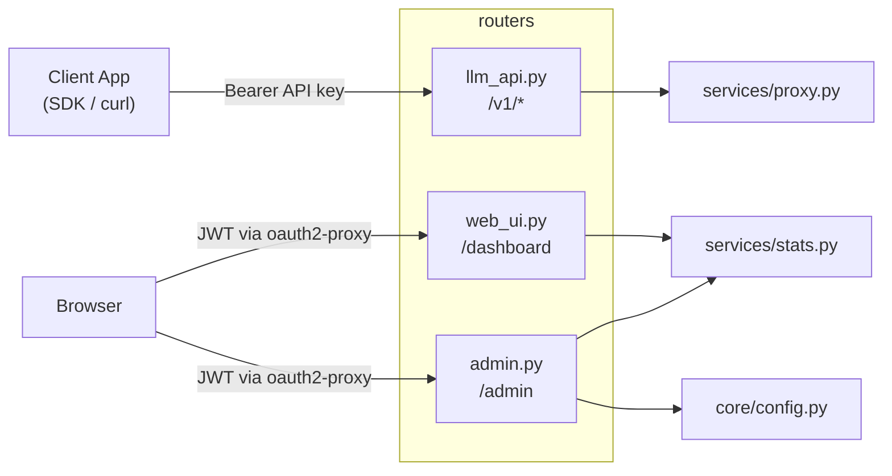
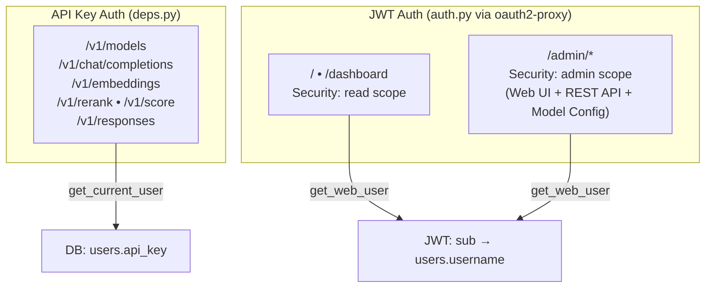

# Routers — API Endpoints and Page Routes

[中文版](README.zh-TW.md)

Defines FastAPI routes, split into three modules: API endpoints, Web UI pages, and Admin management.

## Module Overview



---

## `llm_api.py` — OpenAI-Compatible API

**Auth**: `deps.get_current_user` (API key + daily limit check)

### Endpoints

| Method | Path | Description | Proxy Method | Allowed Types |
|---|---|---|---|---|
| `GET` | `/v1/models` | List all available models | Direct response | — |
| `POST` | `/v1/chat/completions` | Chat completion generation | `forward_request` | `llm`, `vlm` |
| `POST` | `/v1/responses` | Responses API | `forward_to_path` | `llm`, `vlm` |
| `POST` | `/v1/embeddings` | Text embeddings | `forward_simple_request` | `embedding`, `vision_embedding` |
| `POST` | `/v1/rerank` | Document reranking | `forward_simple_request` | `reranker`, `vision_reranker` |
| `POST` | `/v1/score` | Relevance scoring | `forward_simple_request` | `reranker`, `vision_reranker` |

### Three Proxy Methods

| Method | Streaming | Use Case | Features |
|---|---|---|---|
| `forward_request` | stream + non-stream | Chat Completions | SSE parsing, auto-injects `stream_options.include_usage` |
| `forward_simple_request` | non-stream only | Embeddings, Rerank, Score | 120s timeout, handles reranker total_tokens reporting |
| `forward_to_path` | stream + non-stream | Responses API | Raw pass-through, only replaces model field |

### Common Behavior

All proxy methods share `_resolve_model()` for health-aware routing:

```
1. Exact match + server alive → use directly
2. Server DOWN → use configured fallback of same type
3. No match found → use any alive server of same type
4. No alive servers → best-effort try any server of compatible type
```

When fallback occurs, the response includes an `X-Model-Fallback` header explaining the reason.

---

## `web_ui.py` — User Dashboard

**Auth**: `auth.get_web_user` (JWT scope must include `read` or `admin`)

### Endpoints

| Method | Path | Description |
|---|---|---|
| `GET` | `/` | Welcome page: API guide, available models, quick start |
| `GET` | `/dashboard` | Dashboard page: usage stats, trend charts, server status, app accounts |
| `POST` | `/dashboard/refresh-key` | Regenerate own API key, returns JSON `{ok, api_key}` |
| `POST` | `/dashboard/app/{app_id}/refresh-key` | Regenerate owned app account's API key (must be owner) |

### Dashboard Data Sources

| Section | Data Function | Description |
|---|---|---|
| Stats Cards | `get_user_monthly_summary()` | Current month requests, cost, tokens |
| Usage Trend | `get_daily_trends()` | Daily requests/cost for last 30 days |
| My App Accounts | `get_owned_apps_summary()` | Owned app accounts' monthly usage |
| System Status | `MODEL_ROUTING` + `is_alive()` | Server health grouped by type |

---

## `admin.py` — Admin Panel + Admin API

**Auth**: Router-level `Security(get_web_user, scopes=["admin"])` — all `/admin/*` endpoints (including REST API) use JWT auth

### Web UI Endpoints

| Method | Path | Description |
|---|---|---|
| `GET` | `/admin` | Admin home: usage summary, DAU trends, department usage, leaderboards, user management. Supports pagination: `?limit=15&offset=0&app_limit=15&app_offset=0` |
| `POST` | `/admin/users/create` | Create app account (form submit, username auto-prefixed with `app_`) |
| `POST` | `/admin/users/{id}/limit` | Update user daily limit (form submit) |
| `POST` | `/admin/users/{id}/delete` | Delete user and their usage logs (cannot delete self) |
| `POST` | `/admin/users/{id}/refresh-key` | Regenerate any user's API key, returns JSON |
| `GET` | `/admin/models` | Model config page (SPA, loads data via API) |

### Admin REST API (JWT auth, requires admin scope)

| Method | Path | Description |
|---|---|---|
| `GET` | `/admin/users` | List all users (includes `display_name`, `org_code`) |
| `POST` | `/admin/users` | Create user (JSON body: `username`, `daily_limit_usd`, `is_admin`, `owner_id`) |
| `PATCH` | `/admin/users/{id}` | Update user (`daily_limit_usd`, `is_admin`, `owner_id`) |

### Model Config API (JWT auth, requires admin scope)

| Method | Path | Description |
|---|---|---|
| `GET` | `/admin/api/config` | Get `config.toml` contents (models, pricing, fallback) |
| `PUT` | `/admin/api/config` | Save config to `config.toml` and reload immediately |

---

## Route & Auth Reference


