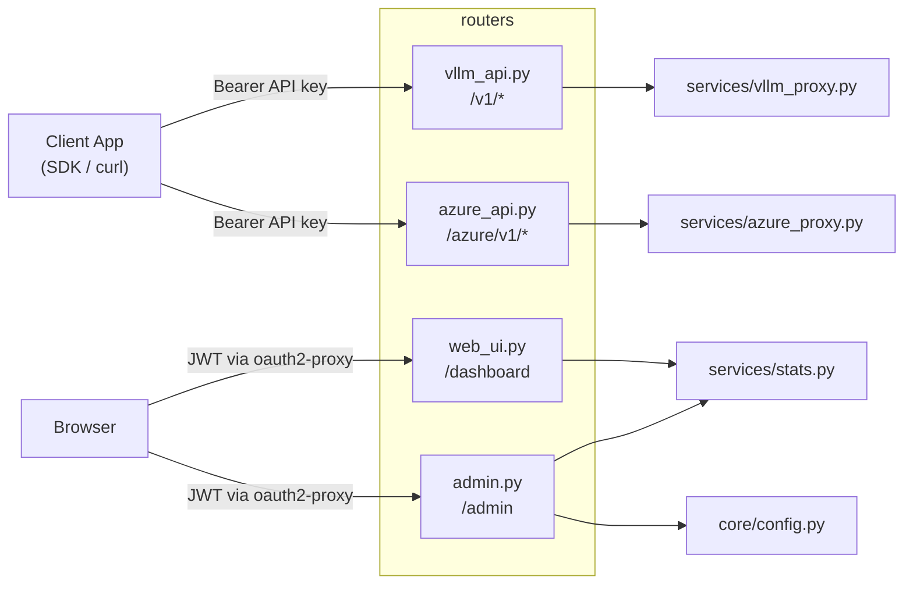

# Routers — API 端點與頁面路由

[English](README.md)

定義 FastAPI 路由，分為四個模組：vLLM API 端點、Azure OpenAI API 端點、Web UI 頁面、Admin 管理。

## 模組總覽



---

## `vllm_api.py` — OpenAI 相容 API（vLLM 後端）

**認證**：`deps.get_current_user`（API key + daily limit 檢查）

### 端點

| 方法 | 路徑 | 說明 | Proxy 方式 | 允許類型 |
|---|---|---|---|---|
| `GET` | `/v1/models` | 列出可用模型(僅 LLM/VLM,Azure 別名不會列出) | 直接回傳 | `llm`, `vlm` |
| `POST` | `/v1/chat/completions` | Chat 對話生成 | `forward_request` | `llm`, `vlm` |
| `POST` | `/v1/responses` | Responses API | `forward_to_path` | `llm`, `vlm` |
| `POST` | `/v1/embeddings` | 文字向量嵌入 | `forward_simple_request` | `embedding`, `vision_embedding` |
| `POST` | `/v1/rerank` | 文件重排序 | `forward_simple_request` | `reranker`, `vision_reranker` |
| `POST` | `/v1/score` | 相關性評分 | `forward_simple_request` | `reranker`, `vision_reranker` |
| `POST` | `/v1/messages`、`/messages` | Anthropic Messages(轉譯為 OpenAI) | `forward_messages_request` | `llm`, `vlm` |
| `POST` | `/v1/messages/count_tokens` | Anthropic token 計數(轉送至 vLLM `/tokenize`,失敗時 fallback 為 chars/4) | `forward_count_tokens_request` | `llm`, `vlm` |
| `POST` | `/v1/tokenize`、`/tokenize` | vLLM 原生 pass-through tokenize | `forward_tokenize_request` | `llm`, `vlm` |

### Proxy 方式

| 方式 | 串流 | 用途 | 特色 |
|---|---|---|---|
| `forward_request` | stream + non-stream | Chat Completions | SSE 解析、自動注入 `stream_options.include_usage` |
| `forward_simple_request` | non-stream only | Embeddings, Rerank, Score | 120s timeout，處理 reranker 的 total_tokens 回報 |
| `forward_to_path` | stream + non-stream | Responses API | Raw pass-through，僅替換 model 欄位 |
| `forward_messages_request` | stream + non-stream | Anthropic Messages | Anthropic→OpenAI 請求、OpenAI→Anthropic 回應(使用 `services/anthropic_adapter.py`) |
| `forward_count_tokens_request` | non-stream | `count_tokens` | 轉送至 vLLM `/tokenize`,失敗時 fallback 為 chars/4;不計費 |
| `forward_tokenize_request` | non-stream | `/tokenize` | vLLM 原生 pass-through;不計費 |

### 共通行為

所有 proxy 方式共享 `_resolve_model()` 做健康感知路由：

```
1. 精確匹配 + 伺服器存活 → 直接使用
2. 伺服器 DOWN → 使用同類型的 configured fallback
3. 找不到匹配 → 使用同類型的任意存活伺服器
4. 無存活伺服器 → best-effort 嘗試任意同類型伺服器
```

Fallback 發生時，回應會帶 `X-Model-Fallback` header 說明原因。

---

## `azure_api.py` — Azure OpenAI 相容

**認證**:`deps.require_azure_access`(包裝 `get_current_user`,額外檢查 `user.can_use_azure`;admin 免檢查) — 與 `/v1/*` 共用同一把 gateway API key 與 daily limit,另外多了使用者層級的 Azure 存取旗標

使用同一把客戶端 API key、同一份 usage log、同一套監控。差異只在於下游 URL/Header 慣例,由 `services/azure_proxy.py` 處理。Azure 部署在 `config.toml` 的 `[azure_models.<alias>]` 設定。沒有 `can_use_azure`(且非 admin)的使用者會收到 403 `"Azure access not granted. Contact your administrator."`。

### 端點

| 方法 | 路徑 | 說明 | Proxy 方式 |
|---|---|---|---|
| `GET` | `/azure/v1/models` | 列出已設定的 Azure 部署(刻意不出現在 `/v1/models`) | 直接回傳 |
| `POST` | `/azure/v1/chat/completions` | 透過 Azure 部署做 chat completion | `forward_chat_completions` |
| `POST` | `/azure/v1/embeddings` | 透過 Azure 部署做 embeddings | `forward_embeddings` |
| `POST` | `/azure/v1/messages`、`/azure/messages` | Anthropic Messages → Azure(共用 `anthropic_adapter`) | `forward_messages` |
| `POST` | `/azure/v1/messages/count_tokens`、`/azure/messages/count_tokens` | Token 計數(chars/4 估算;Azure 沒有 tokenize 端點) | `forward_count_tokens` |

### Azure 特定行為

- URL 格式:`{endpoint}/openai/deployments/{deployment}/{path}?api-version=...`
- Header:`api-key: <key>`(不是 `Authorization: Bearer`)
- 轉發前會把 body 中的 `model` 欄位移除(Azure 是用 URL 中的 deployment 路由)
- 沒有 `_resolve_model` / fallback,別名直接對應到一個 deployment
- OpenAI 格式回應原封不動 pass-through;Anthropic 回應走與 vLLM 路徑相同的轉譯器
- `_calc_cost` 已解耦 — `azure_proxy` 自己查 `AZURE_MODELS`,把 route dict 傳給 `_log_usage(route=...)`

---

## `web_ui.py` — 使用者 Dashboard

**認證**：`auth.get_web_user`（JWT scope 需含 `read` 或 `admin`）

### 端點

| 方法 | 路徑 | 說明 |
|---|---|---|
| `GET` | `/` | Welcome 首頁：API 使用指南、可用模型、快速上手 |
| `GET` | `/dashboard` | Dashboard 頁面：用量統計、趨勢圖、伺服器狀態、App 帳號 |
| `POST` | `/dashboard/refresh-key` | 重新產生自己的 API key，回傳 JSON `{ok, api_key}` |
| `POST` | `/dashboard/app/{app_id}/refresh-key` | 重新產生所屬 App 帳號的 API key（需為 owner） |

### Dashboard 資料來源

| 區塊 | 資料函式 | 說明 |
|---|---|---|
| Stats Cards | `get_user_monthly_summary()` | 當月 requests、cost、tokens |
| Usage Trend | `get_daily_trends()` | 近 30 天的每日 requests / cost |
| My App Accounts | `get_owned_apps_summary()` | 所屬 App 帳號的月用量 |
| System Status | `MODEL_ROUTING` + `is_alive()` | 依類型分組的伺服器健康狀態 |

---

## `admin.py` — 管理面板 + Admin API

**認證**：Router 層統一 `Security(get_web_user, scopes=["admin"])`，所有 `/admin/*` 端點（含 REST API）皆走 JWT 認證

### Web UI 端點

| 方法 | 路徑 | 說明 |
|---|---|---|
| `GET` | `/admin` | Admin 首頁：用量彙總、DAU 趨勢、部門用量、排行榜、使用者管理。支援分頁：`?limit=15&offset=0&app_limit=15&app_offset=0` |
| `POST` | `/admin/users/create` | 建立 App 帳號（Form submit，username 自動加 `app_` 前綴） |
| `POST` | `/admin/users/{id}/limit` | 修改使用者每日限額（Form submit） |
| `POST` | `/admin/users/{id}/delete` | 刪除使用者及其 usage logs（不可刪除自己） |
| `POST` | `/admin/users/{id}/refresh-key` | 重新產生任意使用者的 API key，回傳 JSON |
| `POST` | `/admin/users/{id}/monitor` | 切換使用者的 request/response 監控(回傳 JSON `{ok, monitoring, username}`) |
| `POST` | `/admin/users/{id}/toggle-disable` | 翻轉使用者的 `is_disabled` 旗標。禁止停用自己(回 400);可以重新啟用自己 |
| `POST` | `/admin/users/{id}/toggle-azure` | 翻轉使用者的 `can_use_azure` 旗標(控制 `/azure/v1/*` 存取) |
| `POST` | `/admin/default-limit` | 設定預設每日額度(USD)。寫入 `[app].default_daily_limit_usd` 並批次將 `0 < daily_limit_usd < new_floor` 的使用者拉高到新 floor(`daily_limit_usd = 0` 的無限制使用者不會被改動) |
| `GET` | `/admin/monitor` | 取得監控狀態:目前被監控的使用者及其每類型檔案大小、總磁碟用量 |
| `GET` | `/admin/models` | 模型設定頁面（SPA，透過 API 載入資料） |

### Admin REST API（JWT 認證，需 admin scope）

| 方法 | 路徑 | 說明 |
|---|---|---|
| `GET` | `/admin/users` | 列出所有使用者（含 `display_name`, `org_code`） |
| `POST` | `/admin/users` | 建立使用者（JSON body：`username`, `daily_limit_usd`, `is_admin`, `owner_ids`） |
| `PATCH` | `/admin/users/{id}` | 更新使用者（`daily_limit_usd`, `is_admin`, `owner_ids`） |

### Model Config API（JWT 認證，需 admin scope）

| 方法 | 路徑 | 說明 |
|---|---|---|
| `GET` | `/admin/api/config` | 取得 `config.toml` 內容（models, pricing, fallback, azure_models） |
| `PUT` | `/admin/api/config` | 儲存設定到 `config.toml` 並即時 reload |

---

## 路由與認證對照

```mermaid
graph TD
    subgraph "API Key 認證 (deps.py)"
        V1["/v1/models<br/>/v1/chat/completions<br/>/v1/embeddings<br/>/v1/rerank • /v1/score<br/>/v1/responses<br/>/v1/messages • /v1/messages/count_tokens<br/>/v1/tokenize"]
        Azure["/azure/v1/models<br/>/azure/v1/chat/completions<br/>/azure/v1/embeddings<br/>/azure/v1/messages • /azure/messages<br/>/azure/v1/messages/count_tokens"]
    end

    subgraph "JWT 認證 (auth.py via oauth2-proxy)"
        Dashboard["/ • /dashboard<br/>Security: read scope"]
        Admin["/admin/*<br/>Security: admin scope<br/>(Web UI + REST API + Model Config + Monitor)"]
    end

    V1 -->|get_current_user| DB["DB: users.api_key"]
    Azure -->|require_azure_access<br/>(get_current_user + can_use_azure)| DB
    Dashboard -->|get_web_user| JWT["JWT: sub → users.username"]
    Admin -->|get_web_user| JWT
```
