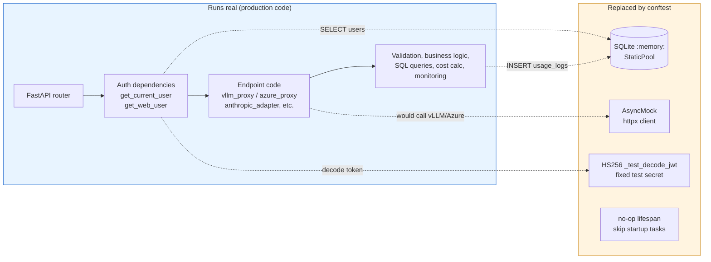
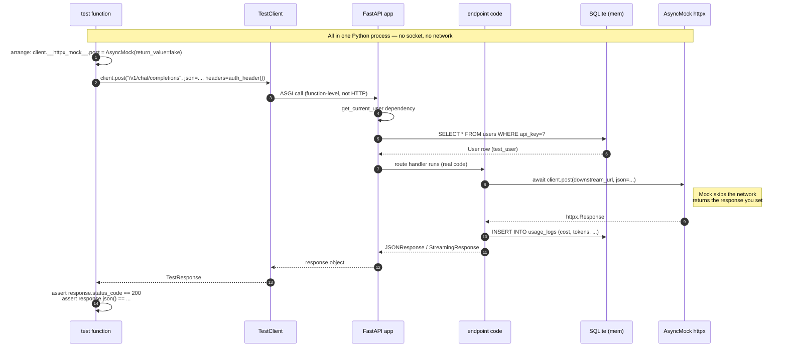

# Tests

Pytest suite covering the full HTTP surface of the gateway. **200 tests** in
18 files; the entire suite runs in ~8 seconds against an in-memory SQLite
database with all downstream HTTP traffic mocked.

```bash
uv run pytest tests/ -v                 # run everything, verbose
uv run pytest tests/test_admin.py -v    # one file
uv run pytest tests/ -k "stream"        # filter by name
```

## How tests are wired (`conftest.py`)

The whole test rig is built so that **no real downstream servers, no real
PostgreSQL, and no real OAuth flow** are ever contacted. Three pieces make
that work:

| Mechanism | What it does |
|---|---|
| In-memory SQLite + `StaticPool` | All connections share one DB, tables reset per test via the `db_session` fixture |
| `_patch_all` autouse fixture | Patches `MODEL_ROUTING`, `PRICING_MAP`, `FALLBACK_MAP`, `AZURE_MODELS`, the global `httpx` client, `is_alive`, and `_decode_jwt` for every test |
| `_build_test_app` | Spins up a `FastAPI` instance with a no-op lifespan (skips DB init, health checks, real httpx client) and mounts `web_ui`, `v1_api`, `azure_api`, `admin` |

### What runs real vs. what's swapped



### Lifecycle of a single test



Useful helpers exposed from `conftest`:

- `client` — `TestClient` with mocked deps; `client.__httpx_mock__` is the shared `AsyncMock` you set return values on
- `test_user` (api_key `sk-testkey123`, daily limit `$100`, `can_use_azure=True`, `is_disabled=False`) and `admin_user` (`sk-adminkey456`, admin scope)
- `auth_header(api_key=...)` for `/v1` / `/azure/v1` Bearer auth, `web_auth_header(scopes=...)` for JWT-protected web routes
- `make_httpx_response(status, json_body)` for non-stream mocks; `FakeStreamResponse(lines)` for SSE mocks
- `TEST_MODEL_ROUTING` / `TEST_AZURE_MODELS` — the per-test alias maps. Six vLLM aliases (`test-llm`, `test-vlm`, `test-embedding`, `test-reranker`, `test-vision-embedding`, `test-vision-reranker`) and two Azure aliases (`azure-gpt-4`, `azure-embed`).

For non-stream HTTP mocks, set `client.__httpx_mock__.post = AsyncMock(return_value=make_httpx_response(...))`. For streams, set `client.__httpx_mock__.send = AsyncMock(return_value=FakeStreamResponse([...]))`.

---

## Tests by file

### `test_chat_completions.py` — `/v1/chat/completions`

The OpenAI-compatible chat endpoint, vLLM backend.

| Test class | What it covers |
|---|---|
| `TestChatCompletionsNonStream` | Happy-path completion; missing-auth 401; health-aware fallback when the primary model's downstream is dead (asserts `X-Model-Fallback` header); downstream connection error → 502; downstream non-200 propagation |
| `TestChatCompletionsToolCall` | Single-turn tool call response; multi-turn with `tool_calls` + `role: "tool"` round-trip |
| `TestChatCompletionsStructuredOutput` | `response_format={"type": "json_object"}` and `{"type": "json_schema", ...}` both forwarded as-is |
| `TestChatCompletionsStream` | SSE happy path: chunked deltas, usage tracked from `[DONE]` chunk, `_log_usage` writes one row |

### `test_messages.py` — `/v1/messages` (Anthropic Messages API)

The largest file in the suite — covers the Anthropic ↔ OpenAI translator
(`anthropic_adapter.py`) plus the routed endpoint.

| Test class | What it covers |
|---|---|
| `TestRequestTranslation` | Pure function tests on `anthropic_to_openai_request`: text content, `system` as string vs list, base64 image blocks → OpenAI `image_url` parts, `tools` schema translation, `tool_use` ↔ `tool_calls` round-trip, `stop_sequences` mapped to OpenAI `stop`; `thinking` blocks in assistant history preserved as `reasoning_content`; `reasoning_effort` mapping (`effort` string and `thinking` budget buckets) emitted only when `is_reasoning=True` |
| `TestResponseTranslation` | `openai_to_anthropic_response`: text response, tool call response, `stop_reason` mapping (`length` → `max_tokens`); `reasoning_content` is surfaced as a leading `thinking` content block before the text block |
| `TestStreamTranslator` | Stateful `AnthropicStreamTranslator` — emits canonical Anthropic SSE event sequence (`message_start` → `content_block_start` → deltas → `message_stop`) for both text and tool calls; `reasoning_content` deltas open a `thinking` block, stream `thinking_delta` events, and close with `content_block_stop` only (no `signature_delta`) before the text block starts; `test_fail_emits_error_and_closes_block` — a downstream drop with no `finish_reason` closes the open block and emits an `overloaded_error` event instead of `message_stop` |
| `TestMessagesEndpointNonStream` | End-to-end: basic message, `x-api-key` header (Anthropic-style auth), 401, valid `x-api-key` overrides bad bearer, system prompt forwarded, tool call, downstream 502, `?beta=...` query param pass-through, alias works without `/v1` prefix |
| `TestCountTokensEndpoint` | `/v1/messages/count_tokens` forwards to vLLM `/tokenize`; falls back to chars/4 estimate on connection error and on 404; `x-api-key` auth; works without `/v1` prefix |
| `TestMessagesEndpointStream` | Full SSE stream end-to-end against a mocked upstream |

### `test_responses.py` — `/v1/responses` (raw pass-through)

The "OpenAI Responses API" endpoint. Body forwarded verbatim except the
`model` field which is alias→real swapped.

Covers: basic response, model-name swap, VLM via responses, missing auth,
malformed JSON → 400, downstream errors, SSE pass-through.

### `test_embeddings.py` — `/v1/embeddings`

Single-input, batch input, alias→real model swap, 401, downstream connection
error → 502, non-200 propagation.

### `test_rerank_score.py` — `/v1/rerank` and `/v1/score`

Cross-encoder reranking. Covers basic flow, `top_n`, model swap, the
`total_tokens`-only response shape (some rerankers don't report `prompt_tokens`),
auth, downstream errors.

### `test_vlm.py` — Vision LLM

Routing for VLM-typed models, base64 images, remote image URLs, multiple
images in one message, the optional `image_url.detail` parameter.

### `test_vision_embedding.py` — `/v1/embeddings` with `vision_embedding` type

Text-only, image URL, base64, batched multi-modal, model swap, downstream
URL construction (asserts the request landed on the right backend),
errors and auth.

### `test_vision_rerank_score.py` — Vision reranker / score

Text documents, image URL, base64, mixed text+image, multi-modal `content`
blocks, downstream URL routing, auth, errors. Two test classes — one per
endpoint.

### `test_tokenize.py` — `/v1/tokenize` (vLLM-native pass-through)

vLLM exposes `/tokenize` directly; the gateway forwards both the
`{model, messages, ...}` and `{model, prompt}` payload shapes verbatim,
only rewriting the `model` alias. Covers both shapes, alias without `/v1`
prefix, `x-api-key` auth, missing auth, malformed JSON, downstream errors,
unknown alias falls back to "any alive LLM".

### `test_render.py` — `/v1/chat/completions/render` (vLLM-native pass-through)

The debug endpoint that renders a chat request through the model's chat
template without generating from it. Covers the happy path (body forwarded
verbatim, alias → `real_model` down and back to the alias on the echoed
`model`, no `usage_logs` row), the alias without the `/v1` prefix, the
reasoning / `reasoning_content` alignment that mirrors `/v1/chat/completions`,
`x-api-key` auth, missing auth, malformed JSON, downstream 502, a 404 from a
vLLM too old to serve the endpoint, unknown-alias fallback, and that an
Azure-configured alias stays on the vLLM path (on-prem-only endpoint) even for
a user with `can_use_azure`. Two further tests pin the documentation contract:
`/openapi.json` carries a request-body schema for both paths (the handler takes
a raw `Request`, so it comes from `openapi_extra`), and fields the schema never
names (`vllm_xargs`, `structured_outputs`, …) still reach the downstream
verbatim — the guard against a future Pydantic body model validating them away.
`TestRenderDecode` covers the decode step (on by default): the detokenize call goes to the same
server that rendered (root `/detokenize`, real_model, the returned ids) and its
text lands in `decoded_prompt`; `?decode=false` makes no second call at all;
a detokenize failure, a non-200, and a render with no `token_ids` each keep the
render and report `decode_error`; a downstream that already returned
`decoded_prompt` keeps its own; and the flag is documented as a query param.
`TestRenderIsNotObserved` pins that the endpoint stays outside billing and
observability on both the success and the error path — no `usage_logs` row and
no Langfuse generation, since a render is a debug query rather than inference.

### `test_models_endpoint.py` — `/v1/models`

| Test class | What it covers |
|---|---|
| `TestListModels` | Only LLM/VLM types are returned (Embedding/Reranker hidden); base fields (`id`, `object`, `owned_by`, `type`, `capability`); optional metadata (`context_window`, `display_name`, `supports_*`) surfaced when set, omitted otherwise; auth required |
| `TestAdminConfigMetadataValidation` | Type checking for `PUT /admin/api/config` — boolean rejected for `context_window`, negatives rejected, string rejected for `supports_tools`, etc. Includes the `bool-as-int` edge case (Python `True` is `int`, so the validator checks `bool` *before* `int`) |
| `TestHiddenModels` | The `hidden` flag: hidden models still appear in `/v1/models` (it's an API endpoint, not a UI listing); the `hidden` field itself is not surfaced in the response |

### `test_azure_api.py` — Azure OpenAI backend

| Test class | What it covers |
|---|---|
| `TestAzureModelsListing` | `GET /azure/v1/models` lists configured Azure deployments; `owned_by` reads `azure-openai`; auth required |
| `TestAzureChatCompletions` | Happy path; **asserts the downstream URL is `…/openai/deployments/<deployment>/chat/completions?api-version=…`**, the auth header is `api-key:` (not `Authorization: Bearer`), and `body.model` is stripped before forwarding; unknown alias → 400 |
| `TestAzureEmbeddings` | Basic embedding call routes correctly |
| `TestAzureMessagesAnthropic` | Anthropic `/azure/v1/messages` translates to Azure chat/completions and back; `count_tokens` returns a chars/4 estimate (Azure doesn't expose tokenize) |

### `test_pricing.py` — Cost calculation (`_calc_cost`)

Pure-function tests on `_calc_cost`, independent of any router.

| Test class | What it covers |
|---|---|
| `TestCalcCostBasics` | Per-model `input_price_per_1m` / `output_price_per_1m` override; fallback to per-type `[pricing.<type>]` when the route carries no override |
| `TestCachedTokenPricing` | `cached_tokens` billed at the discounted `cached_input_price_per_1m` with the uncached remainder at full input price; no cached price → full input rate even when `cached_tokens` is passed; `cached_tokens=0` is a no-op; cached count clamped to total input (never negative); the vLLM path is unaffected since it never passes `cached_tokens` |

### `test_health_metrics.py` — vLLM `/metrics` load scrape

Pure-function tests on the health loop's metrics helpers (`health.py`),
independent of any router. Nine tests covering `_metrics_url` (derives the
`/metrics` URL from an OpenAI-style base_url, stripping a trailing `/v1`)
and `_parse_vllm_metrics` (parses Prometheus text, sums
`vllm:num_requests_running` / `vllm:num_requests_waiting` across
`model_name` labels, returns `None` on a parse miss or non-vLLM output).

### `test_stream_idle_guard.py` — SSE pump max-idle + health pool starvation

Covers the "all models DOWN while containers are alive" failure mode.

| Test class | What it covers |
|---|---|
| `TestPumpMaxIdle` | `_pump_sse_lines` aborts a downstream that produces no data within `max_idle` (yields `('err', TimeoutError)`) and always closes the response so the pool connection is recycled; happy-path lines flow through unchanged |
| `TestHealthPoolStarvation` | `check_all_servers` keeps the previous alive state on `httpx.PoolTimeout` (probe never left the gateway) but still marks the server DOWN on a real `ConnectError` |

### `test_native_messages.py` — `native_messages` pass-through flag

Routes flagged `native_messages = true` forward Anthropic requests as-is to
the downstream vLLM's native `/v1/messages` (>= 0.11.1) instead of
translating via the OpenAI pivot.

| Test class | What it covers |
|---|---|
| `TestNativeNonStream` | Pass-through hits `{base_url}/messages` with alias→real_model swap (response model rewritten back to alias); 404 falls back to the translation path (`/chat/completions`); non-404 downstream errors propagate |
| `TestNativeStream` | Native Anthropic SSE forwarded verbatim with `message_start.model` rewritten to the alias; stream dying without `message_stop` emits an `overloaded_error` event; stream 404 pre-flight falls back to the translated stream |
| `TestNativeCountTokens` | Native `/messages/count_tokens` used when flagged; any failure falls back to the `/tokenize` translation flow |
| `TestNormalizeAnthropicMessages` | `normalize_anthropic_messages` pure-function behavior: schema-clean requests returned as the same object (pure pass-through); leading system-role entries hoisted into the top-level `system` field (existing `cache_control` blocks preserved verbatim); mid-conversation system entries merged into the adjacent user message as `<system-reminder>` text (append to previous user / prepend to next / trailing orphan becomes its own user message); plus an end-to-end check that the native path applies it before forwarding |
| `TestFlagOff` | Without the flag the translation path is used unchanged |

### `test_reasoning_effort.py` — per-model reasoning-effort compatibility

A model entry declaring `reasoning_efforts` gets outgoing requests reconciled
with what that model actually accepts (the case it exists for: an upgrade that
dropped `high`) — remapped where `reasoning_effort_map` says so, stripped
otherwise; a route declaring nothing keeps the faithful pass-through.

| Test class | What it covers |
|---|---|
| `TestNormalizeAndDeclare` | `normalize_effort` spelling variants (`MAX`/`extra-high` → `xhigh`, unknown spellings verbatim); `declared_efforts` normalizes + dedupes, treats `[]` as meaningful ("no effort knob") and a malformed declaration as undeclared |
| `TestAdaptEffort` | Accepted level untouched; unaccepted + unmapped is dropped; `reasoning_effort_map` sends the operator's target (including one outside the declared list, and for an unknown spelling), blank target = drop, malformed map = drop; a map entry never touches an accepted level; undeclared route passes through |
| `TestApplyHelpers` | In-place rewrite/strip of OpenAI `reasoning_effort` and Azure Responses `reasoning.effort` (emptied `reasoning` object removed); bodies without the field, and undeclared routes, untouched |
| `TestVllmChatCompletions` | `/v1/chat/completions` strips an unaccepted effort, sends the mapped one, forwards an accepted one unchanged, and leaves an undeclared route's request alone |
| `TestVllmMessages` | `/v1/messages` reconciles the translated level, including one bucketed from `thinking.budget_tokens`; the `native_messages` path carries no `effort` to adapt (the sanitizer strips it) and forwards `thinking` untouched |
| `TestAzureAdaptation` | `/azure/v1/chat/completions` adapts before the Responses translation; the `/azure/v1/responses` pass-through adapts `reasoning.effort` only for a deployment that declares its levels |
| `TestBedrockAdaptation` | The mapped level is resolved before Converse expands it into a Claude thinking budget (`xhigh` → mapped `medium` → 8192); an unmapped level leaves `additionalModelRequestFields` off entirely |
| `TestConfigPlumbing` | `_build_config` carries both keys onto vLLM / Azure / Bedrock entries (including an empty list) and leaves them absent when undeclared |
| `TestAdminConfigValidation` | `PUT /admin/api/config` 400s on a non-list `reasoning_efforts` / non-table `reasoning_effort_map`, and passes a valid policy through to `save_config` — the admin UI edits these keys outside the `META_KEYS` collect path, so the server must keep what it is sent |

### `test_admin.py` — Admin REST API

| Test class | What it covers |
|---|---|
| `TestCreateUserAPI` | `POST /admin/users` to create app accounts and regular users; duplicate username → 409; empty username → 400; non-admin → 403; CSV export endpoint requires admin |

### `test_app_ownership.py` — App account ownership

App accounts (`app_*` usernames) can have human owners. Tests cover:

- Creating an app with an owner attached
- Setting / clearing an owner via `POST /admin/users/{id}/owner`
- `GET /admin/users` includes `owners` field with username list
- `POST /dashboard/app/{id}/refresh-key` — owner can rotate their app's key, non-owners get 403, missing app → 404, no auth → 401

### `test_disable_user.py` — User disable + Azure access flags

| Test class | What it covers |
|---|---|
| `TestApiKeyDisabledRejection` | A user with `is_disabled=True` gets 403 on `/v1/*` calls; flipping the flag back makes the same key work again |
| `TestDisabledHTMLRendering` | The `AccountDisabledError` global handler discriminates by `Accept`: `text/html` → renders `disabled.html` (asserts the page has "Account Disabled" + "Sign Out"); `application/json` → `{"detail": "Account disabled. Contact your administrator."}` |
| `TestAdminToggle` | `POST /admin/users/{id}/toggle-disable` flips and re-flips the flag; admin cannot disable themselves (400); non-admin scope → 403 |
| `TestAzureToggle` | `POST /admin/users/{id}/toggle-azure` flips `can_use_azure` (the fixture defaults it to `True`, so first toggle flips to `False`) |

Also note `test_azure_blocked_without_can_use_azure` lives in `test_azure_api.py` — it revokes the fixture default and asserts a 403 from `/azure/v1/*`.

### `test_daily_limit.py` — Daily spend cap

| Test class | What it covers |
|---|---|
| `TestDailyLimitEnforcement` | Under-limit request passes; at-or-over limit returns 429 (the post-write race-condition guard logs a warning but doesn't change the response code) |
| `TestPerUserUnlimited` | `daily_limit_usd = 0` skips the limit check entirely |
| `TestGatewaySoftMode` | `ENFORCE_DAILY_LIMIT` env var: `false` lets overage through (with warning log), default-strict, explicit `true` still enforces, value is case-insensitive |

### `test_usage_export.py` — Monthly usage report (xlsx)

| Test class | What it covers |
|---|---|
| `TestParsing` | `parse_ym("2026-04")` round-trip; invalid month raises; `iter_months(start, end)` is inclusive; cross-year iteration; reversed range raises |
| `TestMonthlyReport` | Summary counts DAU/MAU only for human users (excludes `app_*`); department breakdown excludes apps; per-app sheet only lists `app_*` users; user ranking excludes apps |
| `TestTopUsersDelta` | Rank movement between months (e.g., user moved from #5 → #2); new entrant after a month of absence |
| `TestExportEndpoint` | `GET /admin/api/export/usage.xlsx`: admin can download (verifies the workbook returns), non-admin denied, invalid `month` → 400, reversed range → 400, range > 12 months → 400 |

---

## Adding new tests

1. Use the existing `client` fixture and `auth_header()` / `web_auth_header()` helpers — don't build a new `TestClient` from scratch.
2. For non-stream endpoints, set `client.__httpx_mock__.post = AsyncMock(return_value=make_httpx_response(...))`. For SSE, set `client.__httpx_mock__.send`.
3. If you need a new mock model, add it to `TEST_MODEL_ROUTING` (vLLM) or `TEST_AZURE_MODELS` (Azure) in `conftest.py`. The patches in `_patch_all` will pick it up automatically.
4. Use `db_session` directly only if the test needs to seed extra rows (e.g., usage logs, app owners) — most tests just rely on the implicit `test_user` row.
